# SIMPL CRM — Working Doc

Scope: production deployment of SIMPL CRM — the lender's customer / lead / opportunity management system, with AI email assistance and outbound SMS / email campaigns. The repo under `simpl-crm/` contains **four sub-projects**:

- **Backend**: [`simpl_crm/`](../simpl-crm/simpl_crm) — Java 8 / Spring Boot 2.1.6 monolith (Maven artifact `dashmortgage`, ~107 modules)
- **Frontend**: [`Simpl_CRM_AngualarApp/`](../simpl-crm/Simpl_CRM_AngualarApp) — AngularJS 1.7.2 SPA served by nginx
- **Email Generation App**: [`SimplCrmEmailGenerationApp/`](../simpl-crm/SimplCrmEmailGenerationApp) — Next.js 14 standalone service for AI-assisted email composition
- **DB Project**: [`SimplCRM_DB/`](../simpl-crm/SimplCRM_DB) — MySQL 8.0.36 Docker image with a single 755 MB SQL initialization dump

Out of scope: staging environment, other brand profiles in the same codebase (`dash`, `triumph`, `simple`).

**Multi-brand note**: The backend's Maven artifact is `dashmortgage` and the codebase has profiles for four brands — `dash`, `triumph`, `mr` (Mortgage Returns), and `simple`. This doc documents the **SIMPL deployment** (the `mr` profile, in practice — confirmed by the GitLab CI `build mr` stage). The multi-brand mechanism itself is summarised in §3.1.6 but is not the focus of this doc.

---

## 1. Hosting Platform

| | Backend | Frontend | Email Gen App | DB Project |
|---|---|---|---|---|
| AWS account | `459326128614` | `459326128614` | `459326128614` | n/a |
| Region | `us-east-2` | `us-east-2` | `us-east-2` | n/a |
| Build pipeline | AWS CodeBuild — [`simpl_crm/buildspec.yml`](../simpl-crm/simpl_crm/buildspec.yml) | AWS CodeBuild — [`Simpl_CRM_AngualarApp/buildspec.yaml`](../simpl-crm/Simpl_CRM_AngualarApp/buildspec.yaml) | AWS CodeBuild — [`SimplCrmEmailGenerationApp/buildspec-prod.yaml`](../simpl-crm/SimplCrmEmailGenerationApp/buildspec-prod.yaml) | Manual `docker build` (not part of any CodeBuild pipeline) |
| Container registry | ECR `459326128614.dkr.ecr.us-east-2.amazonaws.com/prod/simpl-crm` | ECR `…/prod/simpl-crm-front` | ECR `…/prod/simpl-crm-email-generation-app` | None — the Dockerfile is for fresh-environment seeding, not a deployed service |
| Image tag scheme | Short Git SHA (`prod` profile); else `latest` | Short Git SHA (`production` profile); else `latest` | Short Git SHA always | — |
| Base image — builder | `…/maven-3-jdk-8:latest` (private mirror) | `…/node:15.14.0-alpine3.11` (private mirror) | `…/node:21-alpine` (private mirror) | n/a |
| Base image — runtime | `…/open-jdk-8:latest` (private alpine mirror) | `…/nginx:mainline-alpine3.18` (private mirror) | `…/node:21-alpine` runtime stage | `mysql:8.0.36` |
| Build args | Hardcoded `mvn -P prod` in Dockerfile (does **not** read an `ENVIRONMENT` ARG like SIMPL Pay does) | `NODE_ENV=$PROFILE` (build-time bake of `REACT`-style env vars not used here — config comes via `webpack` `process.env.APPLICATION_BASE_URL`) | `env_file_name=.env.prod`, `next_config=next.prod.config.js` — Next.js standalone build |
| Runtime port | 8080 (`APP_PORT` env var, default 8080) | nginx listens on 3000 | `EXPOSE 3000` but env `PORT=3001` — runs on 3001 |
| Runtime target | **Amazon ECS** — CodeBuild emits `imagedefinitions.json` with container name `prod-simpl-crm` | **Amazon ECS** — container name `angular-app` | **Amazon ECS** — container name `simpl-crm-email-generation-app` | DB itself runs on **Amazon RDS for MySQL** (provisioned outside repo); this Docker image is only for spinning up fresh dev environments |
| Runtime secrets | AWS Secrets Manager (resolved at startup); plus some env vars (`AWS_ACCESS_KEY_ID`, `AWS_SECRET_ACCESS_KEY` — see §6) | Build-time env vars baked into the static bundle | Build-time bake from `.env.prod` file (Next.js standalone) | n/a |
| Public hostname | (behind ALB; not in repo) | `crm.nflp.com` (also `staging.crm.nflp.com` and `advanced-central.com` listed in [`nginx.conf`](../simpl-crm/Simpl_CRM_AngualarApp/nginx.conf)) | Fronted by the same ALB at base path `/email-generation-app` | n/a |

**Region difference vs SIMPL Pay**: SIMPL Pay runs in `us-east-1`; SIMPL CRM runs in `us-east-2`. Same AWS account.

**Frontend buildspec** also runs the same ECR untagged-image cleanup step (`aws ecr batch-delete-image`) as SIMPL Pay.

**Multi-host nginx server**: the frontend container's nginx is configured for **three** server names — `crm.nflp.com`, `staging.crm.nflp.com`, and `advanced-central.com` — plus `localhost`. The third hostname is worth confirming with the team (likely another brand alias).

### Infrastructure (to be filled in)
> Reserved for production infra detail owned outside the codebase: VPC, ALB / target groups, ECS cluster + service definitions, RDS endpoint, Route 53 records, CloudWatch log groups, alarms, etc.

---

## 2. DevOps

This section covers everything between "the source repo" and "a running production container" — pipelines, AWS services, secrets, deploys, observability. The runtime hosting picture is in §1; the application-level architecture is in §3.

### 2.1 Source — AWS CodeCommit (and GitLab as a parallel path)

Source is on AWS CodeCommit (account `459326128614`, region `us-east-2`) — that's what the CodeBuild pipelines pull from.

**Note — two CI paths exist.** Unlike SIMPL Pay where the Helm chart was a clear legacy artifact, here both CI configs are real and active:

| CI path | What it does | Where the image lands | How it deploys |
|---|---|---|---|
| **AWS CodeBuild** ([`buildspec.yml`](../simpl-crm/simpl_crm/buildspec.yml)) | Build with `mvn -P prod`, push to ECR | ECR `prod/simpl-crm` | Emits `imagedefinitions.json` artifact → consumed by CodePipeline ECS deploy action |
| **GitLab CI** ([`.gitlab-ci.yml`](../simpl-crm/simpl_crm/.gitlab-ci.yml)) | Build with `--build-arg profile=mr`, push to GitLab Container Registry | GitLab Registry: `$CI_REGISTRY_IMAGE/mr:${SHA}` and `:latest` | SSH + `sshpass` into a staging / production host that runs a pre-installed `/usr/local/bin/deploy_script.sh` (env vars from `gitlab-deploy-dashmortgage-mr.env`). Production stage requires manual trigger. |

The GitLab path looks like the **legacy** path (SSH into an EC2 / on-prem host), and the CodeBuild path looks like the **current** ECS path — but the GitLab job is explicitly named `deploy mr to production` with `when: manual`, so it's still wired. Worth confirming with the team which path is actually used for prod cutovers.

### 2.2 Environments

Production-only focus for this doc. Other environments visible in the codebase:

| Environment | Backend Spring profile | Hostname | Notes |
|---|---|---|---|
| Production | `prod` | `crm.nflp.com` | Covered in this doc |
| Staging | `staging` (GitLab) / `mr` (Maven profile) | `staging.crm.nflp.com` | Listed for completeness; not detailed |
| Local | `local` | `localhost` | Dev only |
| Test | `test` | n/a | CI tests |

Maven profiles in the backend: `local`, `test`, `prod`, `simple`, `dash`, `triumph`, `mr` — the last four select brand-specific resource filtering. Production prod-brand combination for SIMPL is `prod` × `mr`.

### 2.3 AWS service footprint

Every AWS service touched by SIMPL CRM in production, with the place in the codebase or pipeline that wires it.

| Service | Purpose | Wiring |
|---|---|---|
| **AWS CodeCommit** | Source repo for all 3 deployable apps (account `459326128614`, region `us-east-2`) | Branch push triggers downstream CodeBuild |
| **AWS CodeBuild** | Build + push container images; one project per app per environment | Reads each app's `buildspec.yml` / `buildspec-*.yaml` |
| **AWS CodePipeline** | Orchestrates CodeBuild → ECS deploy (pipeline definition is **not** in this repo) | Implied by the `imagedefinitions.json` output of every buildspec |
| **Amazon ECR** | Container image registry, region `us-east-2` | Three prod repos: `prod/simpl-crm`, `prod/simpl-crm-front`, `prod/simpl-crm-email-generation-app`. Frontend buildspec includes an `aws ecr batch-delete-image` cleanup step for untagged images |
| **Amazon ECS** | Container runtime for backend, frontend nginx, and email-gen Next.js | Container names from `imagedefinitions.json`: `prod-simpl-crm`, `angular-app`, `simpl-crm-email-generation-app` |
| **Application Load Balancer** | Routes `crm.nflp.com` to frontend and `/email-generation-app/*` to email-gen, plus `/api/*` (or similar) to backend | Not in repo |
| **Amazon Route 53** | DNS for `crm.nflp.com`, `staging.crm.nflp.com`, `advanced-central.com` | Not in repo |
| **AWS Certificate Manager (ACM)** | TLS certs for the ALB | Not in repo |
| **AWS Secrets Manager** | Runtime secret resolution | Backend has a dedicated `aws_secrets_manager` module — resolves credentials at startup via the AWS SDK |
| **AWS KMS** | Encrypt-at-rest for Secrets Manager and ECR | Default AWS-managed keys (no customer-managed CMK referenced in the codebase) |
| **Amazon S3** | Heavy use — multiple buckets, see §4 | Backend `aws_s3` module. Used for documents, generated reports (daily / weekly / monthly / quarterly), outbound files, pull-thru, lead reports, archives |
| **Amazon SNS** | Outbound notifications (likely email or push, used by the `aws_sns` module) | Credentials via `AWS_SNS_KEY`, `AWS_SNS_REGION` env vars |
| **Amazon RDS for MySQL** | The `mr` schema (MySQL 8.0) | Endpoint via `DB_CONNECTION_URL` env var; instance provisioned outside repo |
| **Amazon CloudWatch Logs** | ECS container stdout / stderr | Inferred — default ECS `awslogs` driver. Log group naming, retention, and alarms are not configured in the codebase |
| **AWS IAM** | CodeBuild service role, ECS task execution role, ECS task role | Not in repo. **However**: §2.4 below notes that AWS access keys are also passed as env vars in some places — worth confirming whether prod truly uses the task role |

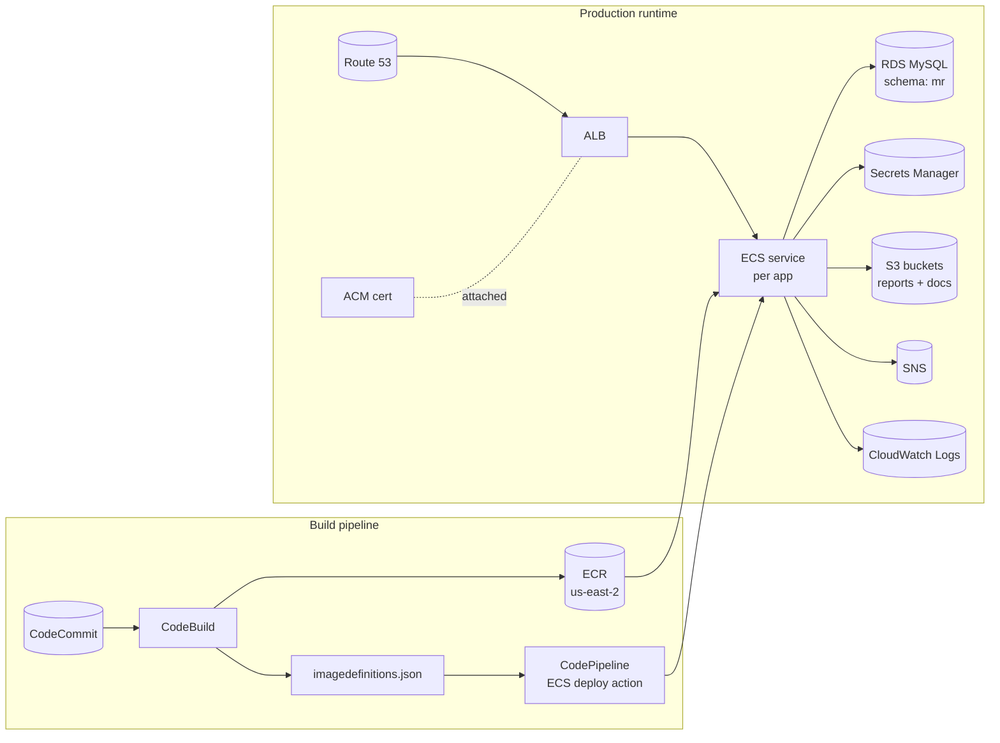

### 2.4 Secrets management

**Storage**: AWS Secrets Manager, resolved at backend startup via the `aws_secrets_manager` module (AWS SDK).

**Backend runtime env vars** (representative — full enumeration in Pass 2): database (`DB_CONNECTION_URL`, `DB_USERNAME`, `DB_PASSWORD`), Twilio (`TWILIO_SIS_ID`, `TWILIO_TOKEN`), SendGrid, Mailgun, DirectMailer, Google Dialogflow + Geocoding, LendingQB, `AWS_SNS_KEY`, `AWS_SNS_REGION`, `AWS_ACCESS_KEY_ID`, `AWS_SECRET_ACCESS_KEY`, JWT signing secret, MFA config, plus app-config env vars like `APP_PORT`, `CONTACT_US_EMAIL`, `HARDCODED_TEST_EMAIL`, `LOGGING_LEVEL`.

**Frontend secrets are build-time**: Webpack reads `process.env.APPLICATION_BASE_URL` (and any other build-time env vars) and bakes them into the static JS bundle. Rotating any of them requires a full image rebuild + ECS deploy.

**Email Gen App secrets are build-time** too: Dockerfile copies `$ENV_FILE` (`.env.prod`) into the image at build, then Next.js standalone reads from `.env.production`.

**KMS**: default AWS-managed keys (no customer-managed CMK referenced).

**Rotation**: no automated rotation visible. Credentials are rotated manually by updating Secrets Manager + restarting ECS tasks (or rebuilding the frontend / email-gen images for build-time secrets).

**A real concern flagged for §6**: the codebase has `AWS_ACCESS_KEY_ID` / `AWS_SECRET_ACCESS_KEY` as env vars in property files. ECS task roles are the standard way to give containers AWS permissions — passing static access keys via env vars is older-style and worth confirming whether prod actually does this or whether the env vars are simply unused fallbacks (overridden by the task role).

### 2.5 Deploy & rollback

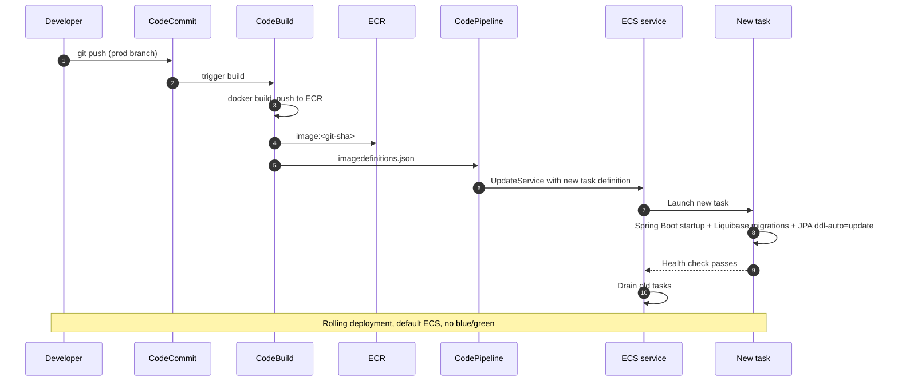

**Forward deploy**: same shape as SIMPL Pay — commit → CodeBuild → ECR → CodePipeline ECS deploy action → rolling rollout. Prod image tags are content-addressable Git SHAs.

**Rollback (production)**: ECS service update pointing at any prior `<git-sha>` ECR tag. No rebuild needed.

**Database migrations on startup — two paths, neither great**:

1. **Liquibase** runs at JVM startup (`spring.liquibase.enabled=true`, changelog at `db/changelog/liquibase-changelog.xml`). Lock table `database_changelog_lock` prevents multi-replica races.
2. **JPA `ddl-auto=update`** (in `application.properties`). This is unusual alongside Liquibase — Hibernate will inspect every `@Entity` at startup and issue `ALTER TABLE` statements to match. In SIMPL Pay this was set to `none` and Liquibase was the only authoritative path. Here, both run. A rogue entity change can produce schema drift between Liquibase's expectation and the actual table. **Flag for §6 — confirm whether `ddl-auto=update` is intentional.**

**`SimplCRM_DB/` (the SQL dump)** is **not** part of the deploy pipeline. It's a fresh-environment seed: a `mysql:8.0.36` Docker image that runs `latest-staging-initialization-dump.sql` from `/docker-entrypoint-initdb.d/` on first start. Used for spinning up new dev / QA environments. Drifts from Liquibase over time and needs to be manually re-exported when stale. Flag for §6.

### 2.6 Observability footprint

Same posture as SIMPL Pay:

| Channel | Status | Notes |
|---|---|---|
| **Container logs** | CloudWatch Logs | Default ECS `awslogs` driver assumed. Backend uses Zalando Logbook (1.13.0) for structured HTTP request logging. Log group naming, retention, and parsing rules are not in the codebase. |
| **Application metrics** | None | No Micrometer / Prometheus / CloudWatch metrics. |
| **APM / tracing** | None | No Datadog, New Relic, Sentry, OpenTelemetry, or X-Ray. |
| **API docs** | Springdoc OpenAPI | `springdoc.swagger-ui.enabled=true` exposes `/swagger-ui.html` and `/v3/api-docs`. This is also what the email-gen app's OpenAPI client is generated from. |
| **Error alerting** | Not in repo | No `mail.exception.to` equivalent is visible at this point; will confirm in Pass 2. |
| **Pipeline alerting** | Not in repo | CodeBuild / CodePipeline failure notifications not configured in this codebase. |

---

## 3. Architecture

### 3.1 Backend — `simpl_crm`

#### 3.1.1 Stack and layout

From [`simpl_crm/pom.xml`](../simpl-crm/simpl_crm/pom.xml):

- Java 8, Spring Boot 2.1.6, Maven, artifact name `dashmortgage` (groupId `com.botscrew`)
- Hibernate / JPA (Spring Data JPA), Liquibase 4.26.0, MapStruct 1.3.1, Lombok
- AWS SDK v2 2.20.43 + legacy v1 1.11.631 (both — see §6)
- Twilio SDK (6.x + 7.x — also both, see §6)
- Google Cloud Dialogflow SDK 0.100.0-alpha, Google API Client 1.23.0
- iText 5.5.12 (PDF), XChart 3.5.0 (charts), Jackson XML / YAML / CSV
- Spring WebSocket + Messaging (STOMP), Spring Security, Spring Mail
- Zalando Logbook 1.13.0 (HTTP request logging)
- Springdoc OpenAPI (Swagger UI)
- libphonenumber 4.3, Ehcache (cache, optional)

**Maven profiles** ([`pom.xml`](../simpl-crm/simpl_crm/pom.xml)): `local`, `test`, `prod`, plus brand-specific `simple`, `dash`, `triumph`, `mr`. Build for SIMPL prod uses `prod` × `mr`. Filtering swaps `spring.profiles.active` and the `custom-*.properties` resource set.

**Top-level layout** under `src/main/java/com/botscrew/dashmortgage/`:

| Folder | Responsibility |
|---|---|
| `configs/` | Spring `@Configuration` beans (security, WebSocket, scheduler, cache, mail, etc.) |
| `modules/` | ~107 feature modules — each typically a domain or external integration |
| `shared/` | Cross-module utilities |

**Module families** (representative selection from the ~107 — full enumeration in Pass 2):

| Family | Example modules | Purpose |
|---|---|---|
| Core CRM domain | `customer`, `contact`, `opportunity`, `lead_*`, `partner`, `employee`, `branches`, `brand` | Customer / lead / opportunity pipeline |
| Outreach | `campaign`, `directmailer`, `daily_email`, `mail`, `mail_sender`, `email_status_holder`, `sendgrid_*`, `twilio`, `dialogflow`, `ai_communication`, `ai_email_generation` | Email, SMS, voice, AI-assisted comms |
| Reporting | `csv_reporter`, `conversion_report`, `statistic` | CSV exports, conversion analytics |
| Auth | `authentication`, `authorization`, `access_level_preset`, `mfa_authentication` | JWT auth, fine-grained authz, MFA |
| External integrations | `aws_s3`, `aws_sns`, `aws_secrets_manager`, `dialogflow`, `dialogflow_address_parser`, `google_geocoding`, `lqb`, `eppraisal`, `avm`, `credit_trigger`, `ad_roll` | Vendor SDK wrappers |
| Mortgage domain | `lqb`, `persitance_lqb_product`, `mortgage_returns`, `avm`, `eppraisal`, `loan_archive` | LendingQB integration, AVM (Automated Valuation Model), property valuations |
| Persistence | ~30 `persistance_*` modules | One per JPA entity family — campaign, customer, branch, brand, calculation, calculator, condition, etc. |
| Infrastructure | `aspect`, `health_check`, `imports`, `migration`, `mocks`, `mock_time`, `notifications`, `exceptions`, `messages`, `global_data_filter` | Cross-cutting concerns, mocks for tests |

**Layering**: REST controllers → services → JPA repositories → MySQL. Many modules expose their own controller + service + repository. AOP aspects in the `aspect/` module for cross-cutting concerns. Spring `@EnableScheduling` + `@EnableAsync` for background work (see §3.1.4). WebSocket via STOMP (see §3.1.5).

#### 3.1.2 Security & auth

Custom Spring Security — no external IdP.

**Session policy**: `STATELESS` (`HttpSecurityConfig.java:142`) — no HTTP sessions. The "cookie" the SPA carries is just a JWT-in-cookie named `Authorization` (with the `Bearer` prefix); the backend treats every request statelessly.

**Filter chain** (added before Spring's `UsernamePasswordAuthenticationFilter`):

1. `JwtAuthorizationFilter` — extracts the JWT from the `Authorization` header/cookie and populates the `SecurityContext`
2. `JwtAuthenticationFilter` — wires the principal for downstream filters

**Authorisation model**: URL-pattern matching in `HttpSecurityConfig.configure()` (lines 63–119), not method-level `@PreAuthorize`. Despite `@EnableGlobalMethodSecurity(prePostEnabled=true)` being on, **no `@PreAuthorize` annotations on controllers were found in the codebase** — all gating happens via `antMatchers(...).hasAuthority(...)`. Authorities are values from a `UserGrantedAuthorityName` enum (e.g. `CUSTOMERS`, `LEADS`, `PARTNERS`, `BRANCH`, `STATISTICS`, `AI_EMAIL_GENERATE`, `REQ_AI_GEN`, `PERMANENTLY_DELETE_CUSTOMER`).

**JWT** (`JwtTokenManagementService.java:69–88`):

| | |
|---|---|
| Algorithm | HMAC-SHA512 |
| Secret config | `security.jwt.tokenSecret` ([`custom-security-jwt.properties:1`](../simpl-crm/simpl_crm/src/main/resources/custom-security-jwt.properties)) |
| TTL — interactive user | 20 minutes (`security.jwt.tokenExpirationTime=20m`) |
| TTL — AI email generation | 30 days (`43200m`) — long-lived because the email-gen app is iframed and needs the token to live across composition sessions |
| Refresh logic | None — new token minted on each successful authentication; no refresh endpoint |
| Cookie name | `Authorization` (Bearer prefix) |
| Token claims | authorities, access level, account role, branch |

**Inter-service JWT identities**: there are two issuer/audience pairs configured ([`custom-gui-server-security-jwt.properties`](../simpl-crm/simpl_crm/src/main/resources/custom-gui-server-security-jwt.properties), [`custom-data-server-security-jwt.properties`](../simpl-crm/simpl_crm/src/main/resources/custom-data-server-security-jwt.properties)):

| Issuer | Audience | Used for |
|---|---|---|
| `gui-server` | `secure-servers` | Tokens minted for SPA users |
| `gui-api` | `data-servers` | Tokens for backend-to-backend (the email-gen Next.js app uses these) |

The presence of a "data-servers" audience suggests other backend services exist beyond this repo — confirm with the team.

**CustomAuthenticationProvider** (`CustomAuthenticationProvider.java:28–76`): looks up `Account` via `UserDetailsServiceImpl.loadUserByUsername()`, verifies password with Spring `PasswordEncoder.matches()` (BCrypt). On success:

- If the user has `ROLE_ADMIN`, role is **downgraded** to `ROLE_PRE_ADMIN` and a 7-digit SMS verification code is sent via Twilio (`MfaSendingExecutor.send2faMessage()`). The 2FA SMS originates from Twilio number `+13037474559` ([`custom-twilio.properties:7`](../simpl-crm/simpl_crm/src/main/resources/custom-twilio.properties)).
- The code is stored in `Account.verificationNumber` (DB), regenerated on each login.
- **Developer override**: accounts with `isDeveloper=true` skip the SMS and receive the hardcoded code `11223344`. **Flagged for §6 — this is a real account-takeover risk in production.**

**MFA** (`mfa_authentication/` module): SMS-based 2FA via Twilio. No TOTP, no email OTP, no WebAuthn. The verification code is stored unsalted in DB and compared as a plain string.

**Principal endpoint** (`PrincipalController.java:26–39`): returns `AccountWithBrandsDTO` (current `Account` + associated `Brand` records). The SPA depends on this immediately after login to decide which AngularJS modules to bootstrap, based on `userAccessLevels[]`.

**Public paths** (allow-listed via `permitAll`): `/swagger-ui.html`, `/swagger-ui/**`, `/v3/api-docs/**` (all reachable in production — flagged for §6), `/health`, plus auth endpoints (`/login`, `/2fa`, password reset).

**Representative URL → authority bindings** (from `HttpSecurityConfig.java:63–119`):

| Pattern | Authority required |
|---|---|
| `POST /api/chats/start-new` | `REQ_AI_GEN` |
| `GET /api/ai-email/fetch-chat` | `AI_EMAIL_GENERATE` |
| `DELETE /customer/permanently/**` | `PERMANENTLY_DELETE_CUSTOMER` |
| `/customer/**` (most) | `CUSTOMERS` |
| `/opportunity/**` | (varies) |
| `/branches/**` | `BRANCH` |
| `/statistic/**` | `STATISTICS` |

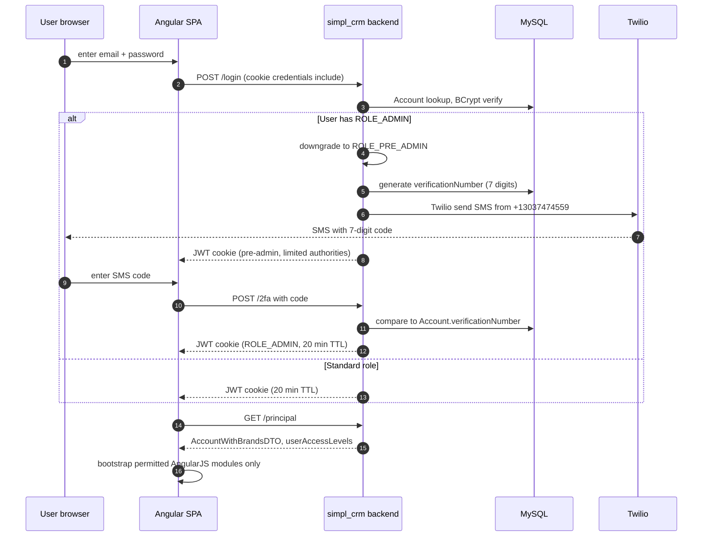

#### 3.1.3 REST API surface

The backend exposes **56 `@RestController` / `@Controller` classes** and **~150–200 endpoints**. Listing every endpoint would run for many pages, so this doc groups them by domain area with 3–5 representative endpoints per area. Full per-controller enumeration to follow in a deeper pass if needed.

Domain groupings (representative — full sampling in Pass 2):

| Area | Controllers / endpoints |
|---|---|
| **Authentication** | `authentication/` — login, logout, JWT issuance, MFA enrolment + verification |
| **Customer / Lead / Opportunity** | `customer/`, `contact/`, `lead_*/`, `opportunity/` — CRUD + state transitions for the core CRM pipeline |
| **Campaigns + outreach** | `campaign/`, `directmailer/`, `sendgrid_*/`, `twilio/`, `email_status_holder/` — send / schedule / list / status |
| **AI email generation** | `ai_email_generation/` — REST + WebSocket endpoints for the email-gen helper (also exposed via auto-generated OpenAPI for the Next.js client) |
| **Calculations / business rules** | `persistance_calculation*`, `calculations/` — runtime calculation engine driving lead scoring + conversion rules |
| **Reporting** | `conversion_report/`, `csv_reporter/`, `statistic/` — CSV exports, conversion analytics, scheduled reports |
| **Admin** | `employee/`, `branches/`, `brand/`, `access_level_preset/`, `authorization/` — staff org structure, permissions, brand config |
| **LQB / mortgage data** | `lqb/`, `persitance_lqb_product/`, `avm/`, `eppraisal/`, `credit_trigger/` — mortgage product cache, AVM, credit monitoring |
| **File uploads / S3** | `aws_s3/`, `imports/`, `loan_archive/` — document upload, manual data import, archive |
| **Health / docs** | `health_check/`, Springdoc `/swagger-ui.html`, `/v3/api-docs` |

#### 3.1.4 Scheduled tasks

Spring `@EnableScheduling` + `@EnableAsync` are on, but **no `@Scheduled` methods are actually used at the JVM level**. Instead, the system uses a DB-driven custom scheduling framework:

- `ScheduledTaskQueueService` manages task definitions
- `ConfigurableSchedulingServiceImpl` reads `scheduled_task` + `scheduled_task_trigger` DB rows to drive what runs
- `QueueExecutorService` executes tasks via a queue with state tracking: `PENDING → RUNNING → SUCCEEDED / FAILED`

This means schedules are **data-driven** — admins can change cadences without a redeploy. The trade-off is that there's no compile-time guarantee about what runs and no IDE-discoverable list of jobs.

Known scheduler-driven flows in the codebase:

| Module | Purpose |
|---|---|
| `daily_email/` — `DailyOpportunityEmailProviderProd` | Daily digest email per loan officer (env-specific provider variants exist for local/test) |
| `credit_trigger/` + `credit_trigger_compliance/` | Webhook receiver for credit-bureau "soft-pull" events, IP-filtered against a whitelist (`CREDIT_TRIGGER_ENABLE_IP_FILTER`), routes parsed events to DirectMailer for printing compliance letters |
| `conversion_report/` + `csv_reporter/` | S3 report generation — daily / weekly / monthly / quarterly closed-loan and TBD exports to the `daily/`, `weekly/`, `monthly/`, `quarterly/` S3 prefixes |
| Template sync toggles | `UPDATE_SENDGRID_TEMPLATES`, `UPDATE_MAILGUN_TEMPLATES`, `UPDATE_DIRECTMAILER_TEMPLATES` — when on at startup, push local template definitions out to each vendor |
| `DIRECT_MAILER_STATUSES_SCHEDULER` (default on) | Polls DirectMailer for status updates on previously-sent mailers |
| `SENDGRID_EMPLOYEE_SYNCHRONIZATION` (default on) | Periodically syncs employee → SendGrid contact records |
| `LQB_MR_IMPORT`, `LQB_MR_TBD_IMPORT` (both default on) | Periodic pull from LendingQB to refresh the local loan/product cache |

#### 3.1.5 WebSocket

STOMP-based, configured in `WebSocketConfig`. Used for real-time updates. Topic structure ([`AiEmailGenerationMessagingClient.java:16–20`](../simpl-crm/simpl_crm/src/main/java/com/botscrew/dashmortgage/modules/ai_email_generation)):

| Direction | Destination | Purpose |
|---|---|---|
| Client → Server | `/topic/email-ai-chat/{chatId}/start-conversation` | Initiate AI response stream |
| Client → Server | `/topic/email-ai-chat/{chatId}/new-employee-message` | User message + opportunity/customer context |
| Server → Client | `/topic/conversation-response/{chatId}` (via `convertAndSendToUser`) | Streamed `OpenAiStreamedMessageResult` tokens — each AI token sent as it arrives from OpenAI |
| Server → Client (other) | Manual import status, scheduling notifications, opportunity status updates | Real-time UI updates from server-side state changes |

#### 3.1.6 Multi-brand profile mechanism (brief)

The same codebase deploys as four brands: `simple`, `dash`, `triumph`, `mr`. The mechanism:

- Maven profiles at build time swap `spring.profiles.active` and select brand-specific `custom-*.properties` files via resource filtering
- The `brand` module (and `persistance_brand` for storage) carries runtime brand-aware behaviour
- `app.logo.path`, `app.favicon.path`, `tab-title` etc. are env-var driven so the same image can render different branding without a rebuild

For SIMPL specifically, the production combination is Maven `prod` × `mr`. The other brands are out of scope for this doc.

### 3.2 Frontend — `Simpl_CRM_AngualarApp`

**Stack** (from [`package.json`](../simpl-crm/Simpl_CRM_AngualarApp/package.json)):

- **AngularJS 1.7.2** — the legacy framework, not modern Angular. Long-term support officially ended **January 2022** — see §6.
- TypeScript 3.3, Webpack 4 with `awesome-typescript-loader` + Babel
- Material (Angular Material 1.1.8 — also legacy), Bootstrap 4, MD Data Table, ng-table, datatables
- chart.js + angular-chart.js for the Statistics / Calculations modules
- `@stomp/stompjs` + `sockjs-client` for the WebSocket transport
- moment + moment-timezone + js-joda for date handling
- Croppie for image crop (avatars, brand config)
- No NgRx / Redux / Akita — plain AngularJS services with DI
- **Not present**: no analytics, no error-tracking SDK (no Sentry/Datadog), no feature-flag library

**Module layout** under `app/`:

| Folder | Responsibility |
|---|---|
| `main.ts` | Entry point — loads user authorities, dynamically imports permitted modules, bootstraps AngularJS |
| `initializers/ActiveBrandInitializer.ts` | Pre-bootstrap fetch of `/principal` (user + brand + access levels) |
| `modules/` | 60+ feature modules — each is a self-contained AngularJS module with its own services / controllers / components / templates / route declaration |
| `public/` | Static assets (fonts, images) |
| `app/index.html` | Root SPA template — backend renders this with Thymeleaf to embed initial user data (`userGrantedAuthorities`) |

**Top-level features** (from the module list under `app/modules/`):

`customers`, `opportunities`, `lead`, `partner`, `campaigns`, `scheduling`, `manual_import`, `statistic`, `calculations`, `branches` (admin), `users` (admin), `redirect`, `user_settings`, plus shared modules: `router`, `main`, `main_service_module`, `utils`, `loader`, `websocket_service`, `filter_components`.

**Backend wiring**:

- Base URL: `process.env.APPLICATION_BASE_URL` (set by Webpack at build time)
- All HTTP requests go through `globalFetch()` with `credentials: "include"` — cookie session auth
- Bootstrap call: `GET /principal` → returns `firstName`, `lastName`, `userAccessLevels[]`. The SPA filters which modules to register based on these access levels.
- 403 handler: `handle403()` redirects to login

**Routing**:

- AngularJS `$routeProvider` — no first-class router config file; each module declares its own routes in `*ModuleConfiguration.ts` and registers them at module-load time
- Default fallback route: `/customers`
- Permission-based loading: a module only registers its routes if the user's access levels match its `requiredAccessLevels`

**WebSocket**: STOMP over SockJS for scheduling, manual imports, opportunity notifications, and the AI email generation stream.

**Serving**:

- `nginx:mainline-alpine3.18` runtime image, listens on **port 3000**
- SPA fallback (`try_files $uri /app/index.html`)
- Gzip on (level 5, ≥256B), long-cache headers on static assets
- nginx `server_name` covers `crm.nflp.com`, `staging.crm.nflp.com`, `advanced-central.com`, `localhost`

### 3.3 Email Generation App — `SimplCrmEmailGenerationApp`

**Stack** (from [`package.json`](../simpl-crm/SimplCrmEmailGenerationApp/package.json)):

- **Next.js 14** (App Router, standalone output mode for containerisation), React 18.2, TypeScript 5.3
- UI: Radix UI + Tailwind CSS + shadcn/ui + Framer Motion
- State: Redux Toolkit
- WebSocket: SockJS + STOMP
- AI: Vercel AI SDK 2.2 + OpenAI SDK 4.24 — direct OpenAI calls for text generation
- Storage: Vercel KV (optional Redis-compatible) for chat history persistence
- API client: **auto-generated from the main backend's OpenAPI spec** via `@openapitools/openapi-generator-cli`

**Role**: standalone Next.js service that provides an AI-assisted email composition UI. The AngularJS SPA opens this app and passes `opportunityId`, `customerId`, and `jwtToken` (the 30-day audience-`data-servers` JWT, §3.1.2) as query parameters.

**Important correction to a common assumption**: The Next.js app **does not call OpenAI directly** despite having the OpenAI SDK in `package.json`. The actual OpenAI request is made server-side by the **backend's** `AiGenerationService` ([`AiEmailGenerationWebsocketController.java:42–46`](../simpl-crm/simpl_crm/src/main/java/com/botscrew/dashmortgage/modules/ai_email_generation)). The Next.js app:

1. Renders the chat UI
2. Opens a STOMP WebSocket to the backend
3. Subscribes to `/topic/conversation-response/{chatId}` to receive streamed `OpenAiStreamedMessageResult` tokens
4. Publishes user messages to `/topic/email-ai-chat/{chatId}/new-employee-message`

The OpenAI SDK dependency in the Next.js app is likely there for type definitions or for an unfinished/alternative path. The actual OpenAI calls flow through the Java backend.

**Chat history** is persisted in the backend's MySQL DB as `AiEmailChat` + `AiEmailMessage` entities ([`AiChatServiceImpl`](../simpl-crm/simpl_crm/src/main/java/com/botscrew/dashmortgage/modules/ai_email_generation), scoped by `ChatType` ∈ {`OPPORTUNITY`, `TBD_CUSTOMER`, `EPO`}) — **not in Vercel KV**. Vercel KV is in the Next.js app's deps but the actual chat persistence is server-side. This is another "dep present but path not used" case worth confirming.

**OpenAI model**: `gpt-4o-mini` ([`custom-open-ai.properties`](../simpl-crm/simpl_crm/src/main/resources/custom-open-ai.properties), [`custom-ai-email-generation.properties`](../simpl-crm/simpl_crm/src/main/resources/custom-ai-email-generation.properties)).

**Important**: the email-gen app **does not send emails**. It only composes drafts. Actual send goes through the backend's email modules (SendGrid / Mailgun / DirectMailer / SMTP).

**Container**:

- Multi-stage Next.js standalone build → `node:21-alpine` runtime
- Build args: `env_file_name=.env.prod` (Next.js reads this as `.env.production`), `next_config=next.prod.config.js`
- `EXPOSE 3000` in the Dockerfile but env `PORT=3001` — actual listening port is 3001
- Base path `/email-generation-app` — fronted by the same ALB as the SPA + backend

### 3.4 Database — `SimplCRM_DB` + the `mr` schema

**Engine**: MySQL 8.0 (Docker image `mysql:8.0.36`).

**Schema**: `mr` (Mortgage Returns — the brand acronym; reused for SIMPL because the same codebase serves both brands). Connection URL pattern: `jdbc:mysql://localhost:3306/mr` for local dev; env-driven (`DB_CONNECTION_URL`) in production. Hikari pool max size 10, min idle 2. Time zone UTC.

**Size**: 85 tables (counted from the SQL dump). Notable production scale: the `addresses` table alone has 1.25M+ rows in the staging dump.

**Migration story — three paths in play, this is the messiest piece of the system**:

1. **Liquibase** (authoritative for ongoing schema evolution) — `spring.liquibase.enabled=true`, changelog at `classpath:/db/changelog/liquibase-changelog.xml`. Lock table `database_changelog_lock`. Initial changelog `db.changelog-1.0.xml` is ~261 KB.
2. **JPA `ddl-auto=update`** — Hibernate inspects every `@Entity` at startup and issues `ALTER TABLE` statements as needed. This runs **alongside** Liquibase. Can produce drift; flagged for §6.
3. **`SimplCRM_DB/` SQL dump** — a 755 MB `latest-staging-initialization-dump.sql` for spinning up fresh environments. Not part of the deploy pipeline; not kept in sync with Liquibase automatically. Drifts. Flagged for §6.

**Entity grouping** by domain (~90 tables total; the staging dump captures 85; Liquibase has added several more since — see "drift" below):

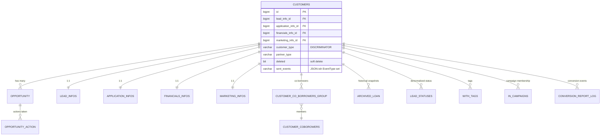

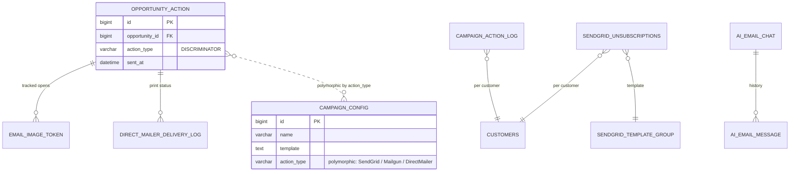

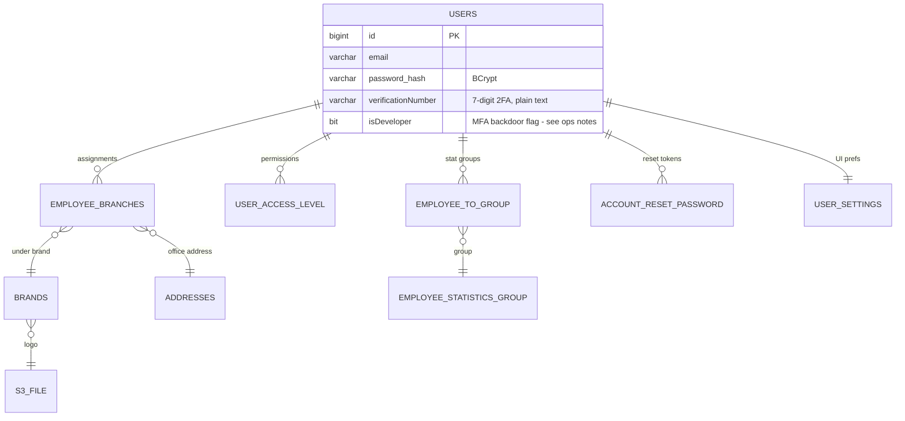

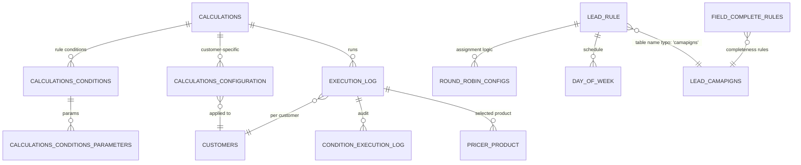

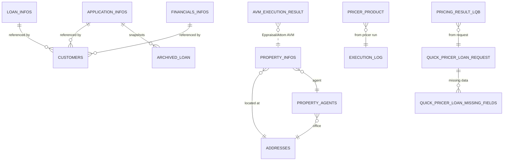

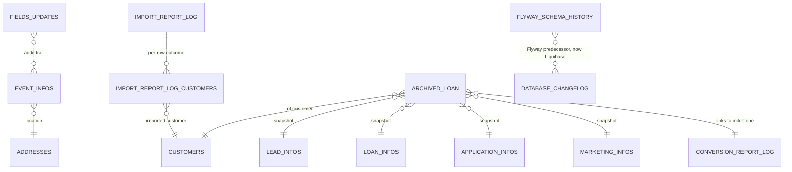

**Tables not pictured** (config / data-mapping / system):

| Group | Tables |
|---|---|
| Config-as-data | `application_dynamic_properties` (polymorphic, ENTITY_TYPE discriminator), `configured_redirect`, `configured_redirect_url_parameter`, `available_notification_parameters`, `subscription_config`, `test_contacts_rules`, `funnel_status`, `statistics_constants` |
| Schedulers | `scheduled_task`, `scheduled_task_trigger` (typo `sceduled_task_id` in FK), `queued_task`, `rate_limited_task_count_log` |
| Calls / SMS | `calls`, `twilio_messages`, `contact_location` |
| Data mapping (ETL) | `entity_field`, `source_field`, `field_mappings`, `field_convertor`, `data_source` |
| Person name parsing | `person_name`, `person_name_value` |
| Notifications | `notification`, `notification_is_read_by` |
| Analytics | `daily_statistic_info`, `statistics_style_configuration` |
| File storage | `s3_file`, `images` |
| Address parsing | `addresses`, `addresses_parsing_info`, `property_agents` |

**Schema oddities** (worth knowing about before reasoning about the data):

1. **Table-name typos baked in**: `lead_camapigns` (should be `_campaigns`), `sceduled_task_id` FK column (should be `scheduled_`), `style_condiguration_id` FK in `users` (should be `_configuration_`). Fixing these requires a destructive migration — they've been left as-is.
2. **Soft-delete via `customers.deleted` BIT(1)** — physical deletion only happens through `DELETE /customer/permanently/**`.
3. **Polymorphic `opportunity_action` via `action_type` discriminator** — `SendGridOpportunityAction`, `MailGunOpportunityAction`, `DirectMailerOpportunityAction` JPA subclasses live in one table.
4. **`customers.customer_type` and `partner_type` discriminators** — customers and partners share the table; `customer_type` distinguishes them at the row level.
5. **Plain-string sets stored as VARCHAR** — `customers.sent_events` is a VARCHAR holding a set of `EventType` enum values via a custom JPA AttributeConverter.
6. **`application_dynamic_properties`** stores app config as data via JPA single-table inheritance with `@DiscriminatorValue` per property type.
7. **`flyway_schema_history` is still in the dump** — the project migrated Flyway → Liquibase at some point; the old table is dead but never dropped.
8. **Time-series snapshots**: `daily_statistic_info`, `archived_loan`, `pricing_result_lqb` capture point-in-time copies of mutable entities for reporting.

**Liquibase ↔ SQL-dump drift (concrete examples)**:

| Object | In Liquibase | In SQL dump | Comment |
|---|---|---|---|
| `opportunity_email_preview` | ✓ | — | AI email preview, recent addition |
| `opportunity_sms_preview` | ✓ | — | AI SMS preview, recent addition |
| `user_sms_settings` | ✓ | — | Recent addition |
| `ai_email_chat` | ✓ | — | AI chat history, recent addition |
| `opportunity_action.action_type` discriminator values | All current subclasses | Older subset | New `action_type` values added without dump refresh |

In practice, the dump lags Liquibase by 2–4 changesets. Running an old dump for a fresh dev environment means Hibernate (`ddl-auto=update`) silently fills in the missing columns / tables at startup — which can mask drift in feature tests.

---

## 4. External Dependencies

The vendor surface is materially wider than SIMPL Pay. Vendors group into five layers:

### 4.1 Communication

| Vendor | Purpose | Module / config | Notes |
|---|---|---|---|
| **Twilio** | SMS for 2FA + marketing campaigns; voice (some) | `modules/sms/`, [`custom-twilio.properties`](../simpl-crm/simpl_crm/src/main/resources/custom-twilio.properties). Credentials: `TWILIO_SIS_ID`, `TWILIO_TOKEN` (currently hardcoded as defaults in the property file). 2FA sender number: `+13037474559`. Toggle: `TWILIO_TOGGLE` (default true). | Twilio SDK is on the classpath in both v6 and v7 — flagged for §6 |
| **SendGrid** | Transactional + marketing email, contact list sync, unsubscribe groups, dynamic templates | `modules/sendgrid*/`, `custom-send-grid*.properties`. Base URL: `https://api.sendgrid.com/v3`. Toggle: `SENDGRID_SERVICES_TOGGLE` (default **false** — confirm whether prod uses SendGrid or not). | Multiple toggles: `SEND_GRID_SYNCHRONIZE_TOGGLE`, `SEND_GRID_TEMPLATE_INITIALIZATION`, `SEND_GRID_REAL_TIME_FIELDS_SYNCHRONIZATION`, `SENDGRID_EMPLOYEE_SYNCHRONIZATION` |
| **Mailgun** | Secondary email channel; webhook event tracking | `modules/mail/mailgun/` (MailGunConfiguration), [`custom-mailgun.properties`](../simpl-crm/simpl_crm/src/main/resources/custom-mailgun.properties). Domain: `email.nflp.com`. Toggle: `UPDATE_MAILGUN_TEMPLATES` | API key currently hardcoded in the property file — flagged for §6 |
| **DirectMailer** | Physical mail (compliance letters, postcards) | `modules/directmailer/`, [`custom-direct-mailer.properties`](../simpl-crm/simpl_crm/src/main/resources/custom-direct-mailer.properties). Endpoint: `print.directmailers.com`. Toggles: `DIRECT_MAILER_TOGGLE`, `DIRECT_MAILER_CANCEL_TOGGLE`, `DIRECT_MAILER_STATUSES_SCHEDULER`, `UPDATE_DIRECTMAILER_TEMPLATES` | Used by credit-trigger compliance letter flow |
| **(Slack)** | Module exists, config is **empty** in source | `custom-slack.properties` (empty) | Either dormant or wired entirely via env vars |
| **(Mandrill / "Madrill")** | Toggle exists (`MADRILL_APP_TOGGLE`, default false) | Property typo in source: "Madrill" rather than Mandrill | Looks dormant |

### 4.2 AI / NLU

| Vendor | Purpose | Module / config | Notes |
|---|---|---|---|
| **OpenAI** | AI email composition (text generation, token streaming) | `modules/ai_email_generation/`, `AiGenerationService`. Model: `gpt-4o-mini` ([`custom-open-ai.properties`](../simpl-crm/simpl_crm/src/main/resources/custom-open-ai.properties), [`custom-ai-email-generation.properties`](../simpl-crm/simpl_crm/src/main/resources/custom-ai-email-generation.properties)). API token: `AI_TOKEN`. | Backend talks to OpenAI directly; SPA streams tokens via STOMP. Next.js app does not call OpenAI despite having the SDK |
| **Google Dialogflow** | NLU for SMS conversational flow (intent detection in inbound texts) | `modules/dialogflow/` + `dialogflow_address_parser`, [`custom-dialogflow.properties`](../simpl-crm/simpl_crm/src/main/resources/custom-dialogflow.properties). Project ID: `test-agent-ab33a`. Endpoint: `https://dialogflow.googleapis.com/v2beta1/...`. Auth: GoogleCredential + service-account JSON. Toggle: `CHATBOT_TOGGLE` (default false). | Distinct from AI email gen — Dialogflow is for SMS chatbots, not email |

### 4.3 Mortgage / Property data

| Vendor | Purpose | Module / config | Notes |
|---|---|---|---|
| **LendingQB / MeridianLink** | Loan-origination system; QuickPricer for rate quotes; reporting batch exports; employee + contact sync | `modules/lqb/`, `persitance_lqb_product/`, [`custom-lqb.properties`](../simpl-crm/simpl_crm/src/main/resources/custom-lqb.properties). URLs: `lending.qb.api.url`, `lending.qb.api.quick.pricer.url`, `lending.qb.api.reporting.url`. OAuth at `secure.mortgage.meridianlink.com/oauth/token`. Two report clients: `LENDING_QB_REPORTING_CLIENT_ID/SECRET` and `LENDING_QB_REPORTING_MR_IMPORT_CLIENT_ID/SECRET`. Report names per environment: `LENDING_QB_REPORT_NAME`, `LENDING_QB_CANCELED_REPORT_NAME`, `LENDING_QB_TBD_REPORT_NAME`. | Same vendor as SIMPL Pay uses, different feature scope (reporting + product data, not document upload) |
| **BSM (BeSmartee)** | Loan-origination partner (alternative LOS for one customer cohort) | [`custom-bsm.properties`](../simpl-crm/simpl_crm/src/main/resources/custom-bsm.properties). Lender ID: `DH1YHKB1` for SIMPL. Encryption key: `BSM_ENCRYPTION_KEY`. Endpoint: `besmartee.com/api`. Toggle: `BSM_APPLICATION_TOGGLE` (default `DASH` — flagged for §6, suggests SIMPL prod might not actually use BSM) | Confusing name vs `BSM_APPLICATION_TOGGLE=DASH` default — clarify with team |
| **Eppraisal** | Automated Valuation Model (AVM) for property values | `modules/eppraisal/`, `EppraisalConfiguration` | Used in loan pricing |
| **Attom** | Real-estate data, secondary AVM | `modules/avm/attom/`, `AttomConfiguration`. API key: `attom.api.key` | Often co-used with Eppraisal |
| **EPO** | Electronic Payable Order — compliance / legal document expiry tracking | [`custom-epo.properties`](../simpl-crm/simpl_crm/src/main/resources/custom-epo.properties). Default expiry: 210 days | Minimal integration, just expiry logic |

### 4.4 Lead-source integrations

These are inbound integrations — third parties that push leads into the CRM. Most are toggled **off** by default in `custom-toggles.properties`. List for awareness:

- `LENDING_TREE_TOGGLE` (default **true**) — LendingTree leads
- `KNOCK_TOGGLE` (default false)
- `LEAD_POINT_TOGGLE` (default false)
- `LIVE_OAK_TOGGLE` (default false)
- `OPCITY_TOGGLE` (default false)
- `ZILLOW_COMARKETING_TOGGLE`, `ZILLOW_LONG_FORM_TOGGLE`, `ZILLOW_PROFILE_TOGGLE` (all default false)
- `FACEBOOK_TOGGLE`, `CF7_TOGGLE`, `REFFERAL_TOGGLE` (all default false)
- `MIXPANEL_TOGGLE` (default false) — analytics input

If prod has any of these on, the team should know which.

### 4.5 Other integrations

| Vendor | Purpose | Module / config |
|---|---|---|
| **AdRoll** | Audience segment sync (refinance, purchase, cashout) for retargeting ads | [`custom-adroll.properties`](../simpl-crm/simpl_crm/src/main/resources/custom-adroll.properties). Advertisable + email-segment IDs. Toggle: `ADROLL_TOGGLE` (default false) |
| **Agile CRM** | Sync brand / branch / loan-officer data into Agile CRM for marketing automation | [`custom-agile.properties`](../simpl-crm/simpl_crm/src/main/resources/custom-agile.properties). Credentials currently hardcoded as defaults. Toggle: `AGILE_CRM_TOGGLE` (default false), `LQB_MR_AGILE_CRM_TOGGLE` (default false) |
| **MortgageBot** | (Module exists, role unclear — `custom-mortgagebot.properties`) | Confirm in next pass |
| **Google Geocoding** | Address validation + enrichment | [`custom-google-address.properties`](../simpl-crm/simpl_crm/src/main/resources/custom-google-address.properties), [`custom-geocoding.properties`](../simpl-crm/simpl_crm/src/main/resources/custom-geocoding.properties). API key: `GOOGLE_CLOUD_GEOCODING_API_KEY` (default `"lalalala"` — placeholder, must be real in prod) |
| **Parserator** | Address parsing service (alternative to internal parser) | [`custom-parserator.properties`](../simpl-crm/simpl_crm/src/main/resources/custom-parserator.properties). API key hardcoded as default. Toggle via `ADDRESS_PARSER_SERVICE` (default `MOCK`) |
| **AWS S3** | Document storage, generated reports (daily / weekly / monthly / quarterly per-env buckets) | `modules/aws_s3/`, [`custom-s3.properties`](../simpl-crm/simpl_crm/src/main/resources/custom-s3.properties), [`custom-gui-s3.properties`](../simpl-crm/simpl_crm/src/main/resources/custom-gui-s3.properties). Credentials currently hardcoded as `S3_KEY` / `S3_SECRET` defaults in source — region `us-east-1` (different from app region `us-east-2`) |
| **AWS SNS** | Outbound notifications | `modules/aws_sns/`, [`custom-aws-sns.properties`](../simpl-crm/simpl_crm/src/main/resources/custom-aws-sns.properties). `AWS_SNS_KEY`, `AWS_SNS_SECRET`, `AWS_SNS_REGION` |
| **AWS Secrets Manager** | Runtime secret resolution | `modules/aws_secrets_manager/`. AWS SDK v2 |
| **MySQL 8.0** (via RDS) | Application database | See §3.4 |

**In-process libraries** (not external services): libphonenumber 4.3, iText 5.5.12 (PDF), XChart 3.5.0 (charts), Springdoc OpenAPI, Ehcache, Zalando Logbook 1.13.0.

### 4.6 Notable absences

- **No external message broker** — no SQS / Kafka / Rabbit / Redis (the email-gen app's Vercel KV is the only Redis-style store, and it's not actually exercised — see §3.3)
- **No external IdP** — auth is fully in-app (BCrypt + SMS 2FA via Twilio)
- **No APM / error tracking** — no Datadog, New Relic, Sentry, OpenTelemetry, AppDynamics, X-Ray
- **No CDN configuration in-repo** — if CloudFront fronts `crm.nflp.com`, it's provisioned outside this codebase

### 4.7 Hardcoded credential audit (flagged for §6)

A non-exhaustive list of credentials that appear as defaults in property files (i.e. baked into the source repo, used if no env override is set):

| Credential | File |
|---|---|
| Twilio Account SID (`TWILIO_SIS_ID`) | `custom-twilio.properties` |
| Twilio Auth Token (`TWILIO_TOKEN`) | `custom-twilio.properties` |
| Mailgun API key | `custom-mailgun.properties` |
| AWS S3 access key + secret + region | `custom-s3.properties` |
| Agile CRM username + password | `custom-agile.properties` |
| Parserator API key | `custom-parserator.properties` |
| DirectMailer UUID user/password | `custom-direct-mailer.properties` |
| Google Cloud service-account JSON path | (referenced in dialogflow config) |

These defaults will be used unless overridden by env vars in the ECS task definition. **Confirm with the team whether prod overrides every one of these** — see §6.

---

## 5. Workflow / Data Flow

### 5.1 System context

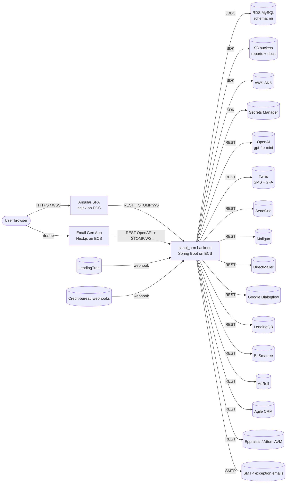

### 5.2 Login + bootstrap (with 2FA)

See §3.1.2 for the full sequence diagram. Summary:

1. User → SPA: email + password
2. SPA → backend `POST /login`
3. Backend verifies BCrypt against `Account`
4. If admin: backend mints a `ROLE_PRE_ADMIN` JWT, sends 7-digit SMS via Twilio, waits for `POST /2fa` to upgrade the token
5. If non-admin: backend mints a `ROLE_*` JWT (20 min TTL)
6. SPA → backend `GET /principal` → returns `AccountWithBrandsDTO`
7. SPA filters which AngularJS modules to register based on `userAccessLevels[]`

### 5.3 AI email generation (cross-service)

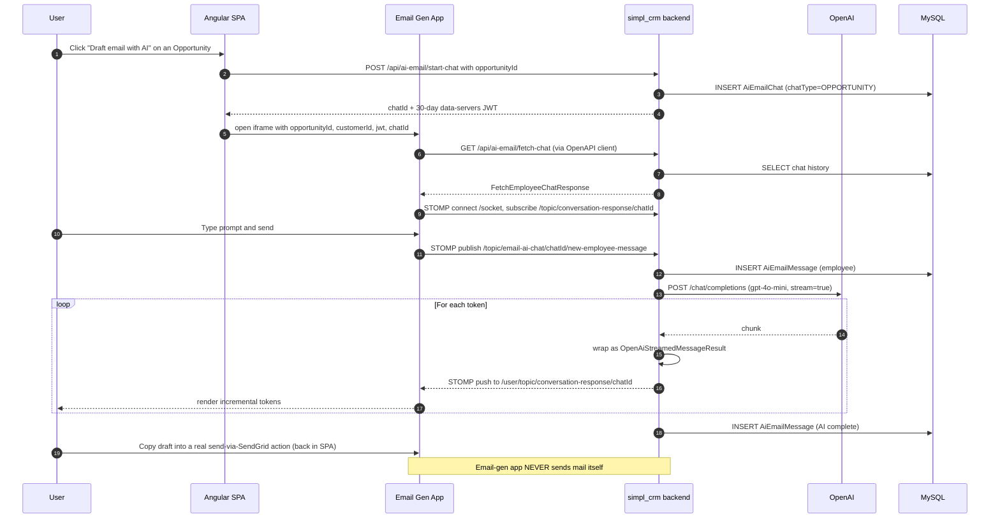

### 5.4 SMS / Twilio outbound (campaign)

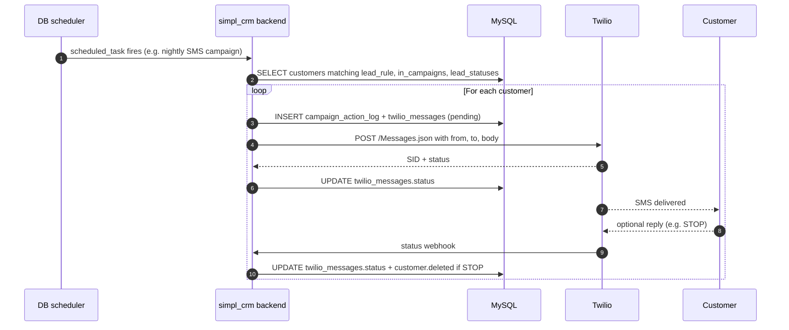

### 5.5 Lead-to-customer lifecycle (canonical happy path)

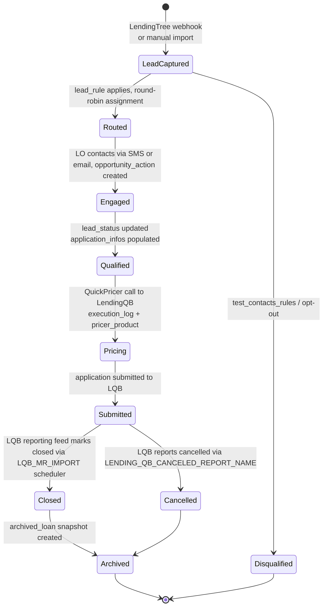

Verify the exact transition triggers with the team — this is the canonical pipeline as inferred from entity relationships + scheduler module names. Some of the transitions (e.g. `Engaged → Qualified`) may be manual LO actions rather than automated state changes.

### 5.6 Credit-trigger compliance flow

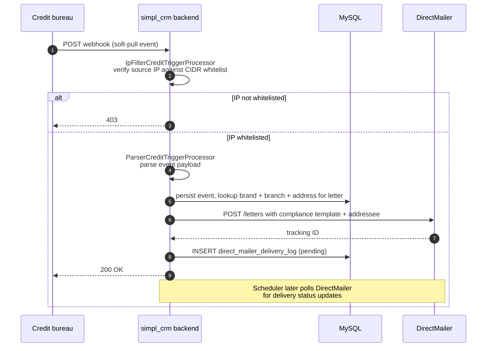

### 5.7 Scheduled / recurring work

| Job | Trigger | Action | Vendor touched |
|---|---|---|---|
| Daily opportunity email | `scheduled_task` row | Query open opportunities per LO → render template → send | SendGrid |
| LQB import (closed loans) | `LQB_MR_IMPORT` toggle on | Pull `LENDING_QB_REPORT_NAME` report → upsert into `loan_infos` + `archived_loan` | LendingQB |
| LQB import (TBD loans) | `LQB_MR_TBD_IMPORT` toggle on | Pull `LENDING_QB_TBD_REPORT_NAME` report → upsert TBD records | LendingQB |
| LQB cancelled loans | `LQB_MR_IMPORT` toggle on | Pull `LENDING_QB_CANCELED_REPORT_NAME` report → mark `lead_statuses` | LendingQB |
| DirectMailer status poll | `DIRECT_MAILER_STATUSES_SCHEDULER` on (default) | Poll DirectMailer for delivery status of pending letters → update `direct_mailer_delivery_log` | DirectMailer |
| SendGrid employee sync | `SENDGRID_EMPLOYEE_SYNCHRONIZATION` on (default) | Sync `users` → SendGrid contacts | SendGrid |
| Template synchronisation | `UPDATE_*_TEMPLATES` (all default off in env) | On startup, push internal templates to vendor | SendGrid / Mailgun / DirectMailer |
| Conversion reports | `scheduled_task` row | Generate CSV → upload to S3 daily/weekly/monthly/quarterly prefix | S3 |
| Address fix-up | `FIX_RAW_ADDRESSES` on, `FIX_ZIP_CODES` on | Resolve raw addresses via Google Geocoding / Parserator | Google Geocoding / Parserator |
| Eppraisal AVM batch | `EPPRAISAL_EQUITY_CALCULATION` (default off) | Run AVM for selected properties | Eppraisal / Attom |

---

## 6. Operational notes & caveats

Items worth surfacing to anyone reading this cold. Grouped by severity.

### 6.1 Security

1. **Developer MFA backdoor**: accounts with `Account.isDeveloper=true` skip the SMS 2FA flow and accept the hardcoded code `11223344` ([`CustomAuthenticationProvider.java`](../simpl-crm/simpl_crm/src/main/java/com/botscrew/dashmortgage/modules/authentication)). If any `isDeveloper` accounts exist in production with `ROLE_ADMIN`, this is a complete admin-takeover path for anyone who knows about it. **Action**: list every `isDeveloper=true` user in prod; disable in prod entirely or gate by a per-environment toggle.
2. **2FA codes stored as plain text in DB**: `Account.verificationNumber` is a plain 7-digit string compared with `.equals()`. They're regenerated on each login, but a DB compromise reveals active codes.
3. **Swagger UI is reachable in production**: `/swagger-ui.html`, `/swagger-ui/**`, `/v3/api-docs/**` are `permitAll` in [`HttpSecurityConfig.java:68`](../simpl-crm/simpl_crm/src/main/java/com/botscrew/dashmortgage/configs). Anyone can enumerate the 150–200 endpoints. **Action**: gate behind admin auth or disable in prod via Spring profile.
4. **Hardcoded credentials in property files** (used as defaults if env vars not set): Twilio SID + token, Mailgun API key, AWS S3 key + secret, Agile CRM password, Parserator API key, DirectMailer UUID user + password. See §4.7 for the full list. **Action**: confirm prod overrides every one of these and rotate any that have been live with the source-default value.
5. **JWT secret rotation**: not visible. The signing secret (`security.jwt.tokenSecret`) is a static string; rotating it would invalidate every in-flight 20-minute user token and every 30-day AI-email token simultaneously. There's no rolling-key support.
6. **AWS static access keys in property files**: `AWS_ACCESS_KEY_ID` / `AWS_SECRET_ACCESS_KEY` / `AWS_SNS_KEY` / `AWS_SNS_SECRET` / `S3_KEY` / `S3_SECRET` are env-var inputs. ECS task roles would be standard. **Action**: confirm prod uses task role with empty/dummy env vars, or remove the env-var path entirely.
7. **Two AWS SDKs on the classpath** (v1 1.11.631 + v2 2.20.43). v1 is EOL as of Dec 2025. **Action**: plan migration of remaining v1 callers.

### 6.2 Reliability / correctness

8. **JPA `ddl-auto=update` runs alongside Liquibase** ([`application.properties:21`](../simpl-crm/simpl_crm/src/main/resources/application.properties)). Hibernate will silently `ALTER TABLE` to match `@Entity` annotations at startup, in addition to Liquibase's changesets. Drift risk + lock-table-bypass risk on multi-replica startup. **Action**: switch to `ddl-auto=none` (and fix any tests that depend on auto-create).
9. **SimplCRM_DB SQL dump drifts from Liquibase**: confirmed concrete examples include `opportunity_email_preview`, `opportunity_sms_preview`, `user_sms_settings`, `ai_email_chat` (all in Liquibase, not in the dump). Anyone spinning up a fresh dev environment from the dump gets the gaps silently filled in by `ddl-auto=update`, which masks the drift. **Action**: either re-export the dump on a cadence, or retire it and use Liquibase-from-scratch for fresh environments.
10. **`/health` is a hardcoded `'status': 'UP'` string** — no DB / external-service checks. ALB will keep traffic on a broken backend. **Action**: switch to Spring Actuator's `/actuator/health` (which the starter is already on the classpath for) and re-point the ALB.
11. **Scheduling is fully data-driven** (`scheduled_task` / `scheduled_task_trigger` tables). There's no compile-time list of recurring jobs. **Action**: maintain a runbook listing every active row in `scheduled_task` and its purpose.
12. **DB schedulers are not multi-replica safe** — the scheduler logic does not appear to use leader election or a distributed lock. Running >1 backend replica may produce duplicate executions of scheduled tasks. Mitigated by running a single replica today (confirm).
13. **Two Twilio SDKs on the classpath** (v6 + v7). Which is the live path? Coexistence often means one is dead code.
14. **`ROLE_ADMIN → ROLE_PRE_ADMIN` downgrade pattern is a custom one** — Spring's standard MFA story is different. Any developer onboarding will need a runbook to understand it.

### 6.3 Operational visibility

15. **No APM / metrics / error tracking** — no Sentry, Datadog, New Relic, Prometheus, Micrometer, OpenTelemetry. Only signals are stdout (CloudWatch Logs) and the SMTP exception emails to the `error-handler.emails` list (currently `spodaryk.roman@outlook.com, testsimplcrm@outlook.com, dmytro.kostyushko@botscrew.com, mykhailo.marchuk@botscrew.com, sofiia.khudo@botscrew.com`).
16. **Exception emails throttle at 20 per 2-minute window** ([`EmailErrorHandler`](../simpl-crm/simpl_crm/src/main/java/com/botscrew/dashmortgage/modules/aspect)) — during a real incident, after the 20th alert the team is silently muted for the rest of the window.
17. **Spring Actuator is on the classpath but not exposed** — same as SIMPL Pay. Quick win: expose `/actuator/health` and the basic metrics endpoints.
18. **`flyway_schema_history` is still in the dump** — the project migrated from Flyway to Liquibase; the old metadata table was never dropped. Harmless but confusing.

### 6.4 Architectural ambiguities to confirm with the team

19. **Two CI paths active**: AWS CodeBuild ([`buildspec.yml`](../simpl-crm/simpl_crm/buildspec.yml)) pushes to ECR + emits `imagedefinitions.json` for ECS; GitLab CI ([`.gitlab-ci.yml`](../simpl-crm/simpl_crm/.gitlab-ci.yml)) builds with `--build-arg profile=mr`, pushes to GitLab Container Registry, then SSH+sshpass-deploys to a host running `/usr/local/bin/deploy_script.sh`. **Both can deploy to production**. Which is canonical? Is the SSH+sshpass path still used?
20. **Multi-brand mechanism is partial**: there are four brand Maven profiles (`simple`, `dash`, `triumph`, `mr`) but GitLab CI has only a `build mr` job — no `build simple` / `build dash` / `build triumph`. Brand selection in deployed images is therefore mostly via env vars (`BSM_APPLICATION_TOGGLE=DASH` etc.) rather than build-time profile selection. **Is the SIMPL deployment actually `prod` × `mr` or `prod` × `simple`?** The artifact name is `dashmortgage`, the schema is `mr`, the logo path defaults to `simple-crm-logo.svg`, the tab title defaults to `Simpl CRM`. Mix of all three brands in defaults. Worth a clear answer.
21. **`BSM_APPLICATION_TOGGLE` defaults to `DASH`**, not `MR` or `SIMPLE`. If SIMPL prod doesn't override it, the BSM integration thinks it's running for the DASH brand. Confirm.
22. **Email-gen app dependencies suggest paths that aren't used**: it has the OpenAI SDK and Vercel KV, but actual OpenAI calls happen server-side and chat history is in MySQL, not KV. Worth confirming whether there's a future direct-from-Next.js path planned or whether these are leftover deps.
23. **Two JWT issuer / audience pairs** (`gui-server`/`secure-servers` and `gui-api`/`data-servers`) hint at other backend services in the system. Are there other Java services in this AWS account that this codebase talks to?
24. **`advanced-central.com` in [`nginx.conf`](../simpl-crm/Simpl_CRM_AngualarApp/nginx.conf) `server_name`** — third hostname alongside `crm.nflp.com` and `staging.crm.nflp.com`. What is it?
25. **Test env uses H2 in-memory** ([`application-test.properties`](../simpl-crm/simpl_crm/src/main/resources/application-test.properties)) instead of MySQL via Testcontainers. Tests won't catch MySQL-specific bugs (collation, JSON column behaviour, full-text indexing, etc.).

### 6.5 Tech-debt observations

26. **AngularJS 1.7.2 is end-of-life** — long-term support ended January 2022. No security patches from Google. There are 60+ feature modules — migration to a modern framework would be a substantial project, but the security risk grows each year.
27. **Java 8 + Spring Boot 2.1.6**: also EOL. Spring Boot 2.1 went out of OSS support November 2020.
28. **Table-name typos baked into schema**: `lead_camapigns` (campaigns), `sceduled_task_id` (scheduled), `style_condiguration_id` (configuration). Renaming requires a destructive migration; living with them is fine but every developer trips on them once.
29. **Many `Toggle` env vars (≥30)** for vendor integrations and feature flags. Worth a single doc page listing what's actually on in production.
30. **Multiple email vendors** — Twilio + SendGrid + Mailgun + DirectMailer all active. Each has its own template-sync toggle, status-poll toggle, etc. Worth understanding which is the canonical channel for what, and whether any can be retired.

---

## Quick reference — key files

- **Backend**: [`pom.xml`](../simpl-crm/simpl_crm/pom.xml), [`Dockerfile`](../simpl-crm/simpl_crm/Dockerfile), [`buildspec.yml`](../simpl-crm/simpl_crm/buildspec.yml), [`.gitlab-ci.yml`](../simpl-crm/simpl_crm/.gitlab-ci.yml), [`liquibase.properties`](../simpl-crm/simpl_crm/liquibase.properties), `src/main/resources/application*.properties`, `src/main/resources/custom-*.properties`, `src/main/java/com/botscrew/dashmortgage/{configs,modules,shared}`
- **Frontend**: [`package.json`](../simpl-crm/Simpl_CRM_AngualarApp/package.json), [`Dockerfile`](../simpl-crm/Simpl_CRM_AngualarApp/Dockerfile), [`nginx.conf`](../simpl-crm/Simpl_CRM_AngualarApp/nginx.conf), [`buildspec.yaml`](../simpl-crm/Simpl_CRM_AngualarApp/buildspec.yaml), `webpack.config.js`, `app/main.ts`, `app/initializers/ActiveBrandInitializer.ts`, `app/modules/router/`
- **Email gen**: [`package.json`](../simpl-crm/SimplCrmEmailGenerationApp/package.json), [`Dockerfile`](../simpl-crm/SimplCrmEmailGenerationApp/Dockerfile), [`buildspec-prod.yaml`](../simpl-crm/SimplCrmEmailGenerationApp/buildspec-prod.yaml), `src/api/apis/`, `src/lib/features/api/api-config.ts`
- **DB project**: [`SimplCRM_DB/Dockerfile`](../simpl-crm/SimplCRM_DB/Dockerfile), `latest-staging-initialization-dump.sql` (table list only — not the 755 MB of contents)
