# SIMPL Pay — Working Doc

Scope: production deployment of SIMPL Pay — the public-facing payment intake app for loan fees. Two services in this repo under `processing-app/`:

- **Backend**: [`payment-application/`](../processing-app/payment-application) — Java 8 / Spring Boot 2.4 REST + WebSocket service
- **Frontend**: [`payment-application-front/`](../processing-app/payment-application-front) — React 16 SPA served by nginx

Out of scope: `processing-app/processing-application/`, `processing-app/prototype/`, and the staging environment.

The codebase supports two distinct payment scenarios distinguished by a `Loan.loan_type` discriminator:

| Discriminator | Java subclass | Business purpose | Payment rail |
|---|---|---|---|
| `APPRAISAL_FEE_LOAN` | `CreditCardLoan` | Upfront fees (appraisal, credit report) at loan origination | Credit card via Stripe |
| `INTEREST_LOAN` | `AchLoan` | Ongoing periodic loan payments | ACH via Stripe |

This split shows up everywhere downstream — different controllers, different webhook secrets, different event handlers, different (or absent) receipt rendering.

---

## 1. Hosting Platform

| | Backend | Frontend |
|---|---|---|
| AWS account | `459326128614` | `459326128614` |
| Region | `us-east-1` | `us-east-1` |
| Build pipeline | AWS CodeBuild — [`production-codebuild-buildspec.yaml`](../processing-app/payment-application/production-codebuild-buildspec.yaml) | AWS CodeBuild — [`production-front-codebuild-buildspec.yaml`](../processing-app/payment-application-front/production-front-codebuild-buildspec.yaml) |
| Container registry | ECR `459326128614.dkr.ecr.us-east-1.amazonaws.com/prod/payment-application` | ECR `459326128614.dkr.ecr.us-east-1.amazonaws.com/prod/payment-application-front` |
| Image tag scheme | Short Git SHA (first 7 chars of `CODEBUILD_RESOLVED_SOURCE_VERSION`) | Short Git SHA |
| Base image — builder | AWS-ECR mirror of `maven:3.8.6-openjdk-8` | `node:16-alpine` |
| Base image — runtime | AWS-ECR mirror of `openjdk:8-alpine3.8` | `nginx:mainline-alpine3.18` |
| Build arg | `ENVIRONMENT=production` → Maven `-P production` profile → filters `application.properties` to bake `spring.profiles.active=production` | `NODE_ENV=production` plus build-time `REACT_APP_*` ARGs baked into the static bundle |
| Runtime target | **Amazon ECS** — CodeBuild emits `imagedefinitions.json` with container name `prod-payment-app-main` | **Amazon ECS** — `imagedefinitions.json` with container name `react-app`; nginx on port 3000 |
| Runtime secrets | AWS Secrets Manager (AWS SDK v2 at startup) | n/a — env vars baked in at build time |
| Public hostname | (behind ALB; FQDN configured outside the repo) | `pay.nflp.com` (also `testpay.nflp.com` for non-prod in [`nginx.conf`](../processing-app/payment-application-front/nginx.conf)) |

**Frontend buildspec** also runs a cleanup step that deletes untagged ECR images after each push.

**Helm chart caveat.** A Helm chart exists at [`payment-application/ops/chart`](../processing-app/payment-application/ops/chart) (Deployment + Service + Ingress + ConfigMap + Secret + HPA; ingress + HPA disabled by default). Its default image is `registry.gitlab.com/bots-crew/payment-app/payment-app:latest` (GitLab, not ECR), and the [`Makefile`](../processing-app/payment-application/Makefile) `deploy-production` target wraps `helm upgrade`. This is a **parallel / historical Kubernetes deploy path** — production today is ECS via CodeBuild.

### Infrastructure (to be filled in)
> Reserved for production infra detail owned outside the codebase: VPC, ALB / target groups, ECS cluster + service definitions, RDS endpoint, Route 53 records, CloudWatch log groups, alarms, etc.

---

## 2. DevOps

This section covers everything between "the source repo" and "a running production container" — pipelines, AWS services, secrets, deploys, observability. The runtime hosting picture is in §1; the application-level architecture is in §3.

### 2.1 Source — AWS CodeCommit

Both apps' source is hosted in AWS CodeCommit (account `459326128614`, region `us-east-1`). Each push to a tracked branch fires a CodeBuild project via a CodeCommit trigger; CodeBuild reads the `*-codebuild-buildspec.yaml` at the repo root that matches the target environment.

The Maven build profile and Docker build args are environment-dependent, so each environment has its own dedicated buildspec file rather than a single parameterised one:

| App | File | Purpose |
|---|---|---|
| Backend | [`processing-app/payment-application/staging-codebuild-buildspec.yaml`](../processing-app/payment-application/staging-codebuild-buildspec.yaml) | Build + push staging image |
| Backend | [`processing-app/payment-application/production-codebuild-buildspec.yaml`](../processing-app/payment-application/production-codebuild-buildspec.yaml) | Build + push production image |
| Frontend | [`processing-app/payment-application-front/staging-front-codebuild-buildspec.yaml`](../processing-app/payment-application-front/staging-front-codebuild-buildspec.yaml) | Build + push staging image |
| Frontend | [`processing-app/payment-application-front/production-front-codebuild-buildspec.yaml`](../processing-app/payment-application-front/production-front-codebuild-buildspec.yaml) | Build + push production image |

Every buildspec emits an ECS-compatible `imagedefinitions.json` artifact, which the downstream deploy stage (CodePipeline or manual ECS service update) consumes to roll the new image into the target ECS service.

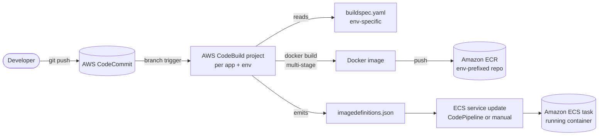

### 2.2 Environments

Three environments are defined across the build chain — `local`, `staging`, and `production`. The first is for developer machines and uses no CI pipeline; the latter two each get a CodeBuild project per app.

| | local | staging | production |
|---|---|---|---|
| Trigger | `mvn`/`npm` on dev machine | CodeCommit push to staging branch | CodeCommit push to prod branch |
| Backend Maven profile | `local` (default) | `staging` | `production` |
| Backend Docker build-arg | n/a — no Docker build | `ENVIRONMENT=staging` | `ENVIRONMENT=production` |
| Frontend env vars | `.env.development` (localhost backend, Plaid sandbox) | Sourced from Secrets Manager `/SimplProcess/payment_application/dev:*` at buildspec time, baked into image as `REACT_APP_*` ARGs | `.env.production` + buildspec ARGs (pay.nflp.com, Plaid production) |
| Backend ECR repo | n/a | `459326128614.dkr.ecr.us-east-1.amazonaws.com/dev/payment-application` | `459326128614.dkr.ecr.us-east-1.amazonaws.com/prod/payment-application` |
| Frontend ECR repo | n/a | `459326128614.dkr.ecr.us-east-1.amazonaws.com/dev/payment-application-front` | `459326128614.dkr.ecr.us-east-1.amazonaws.com/prod/payment-application-front` |
| Image tag | n/a | `latest` (mutable — each build replaces it) | Short Git SHA (immutable, traceable to commit) |
| ECS container name in `imagedefinitions.json` | n/a | backend: `main`, frontend: `react-app` | backend: `prod-payment-app-main`, frontend: `react-app` |
| Frontend ECR housekeeping | n/a | Deletes untagged ECR images after each push | Deletes untagged ECR images after each push |
| Secrets at runtime | local properties files; test Stripe keys hardcoded in `custom-stripe-local.properties` | AWS Secrets Manager (paths under `/SimplProcess/payment_application/dev`) | AWS Secrets Manager (prod paths) |
| Backend public host | `http://localhost:8080` | (configured in ECS / ALB outside the repo) | `https://pay.nflp.com` |
| Frontend public host | `http://localhost:3000` | `testpay.nflp.com` (the non-prod hostname allowed in [`nginx.conf`](../processing-app/payment-application-front/nginx.conf)) | `pay.nflp.com` |

**Naming inconsistency worth flagging**: the staging-environment buildspec is named `staging-*-buildspec.yaml` but pushes to ECR paths prefixed `dev/*`. The two terms are used interchangeably in this codebase — they refer to the same single non-prod environment.

**Image tagging difference matters operationally**: staging deploys overwrite the `latest` tag, so the ECS task definition always pulls the most recent build and rollbacks require re-running an old build. Production tags are content-addressable (Git SHA), so rolling back to a prior revision is just an ECS service update pointing at the older tag — no rebuild needed.

The remaining sections of this doc cover the **production** environment only — staging is scoped out for runtime/architecture purposes. The two non-prod environments are documented here in DevOps because that's where they differ most materially.

### 2.3 AWS service footprint

Every AWS service touched by SIMPL Pay in production, with the place in the codebase or pipeline that wires it.

| Service | Purpose | Wiring |
|---|---|---|
| **AWS CodeCommit** | Source repo for both apps (account `459326128614`, region `us-east-1`) | Branch push triggers downstream CodeBuild |
| **AWS CodeBuild** | Build + push container images; one project per app per environment | Reads `*-codebuild-buildspec.yaml` at the repo root |
| **AWS CodePipeline** | Orchestrates CodeBuild → ECS deploy (pipeline definition is **not** in this repo — managed in the AWS console / a separate infra repo) | Implied by the `imagedefinitions.json` output of every buildspec — this artifact format is consumed by the CodePipeline "Amazon ECS" deploy action |
| **Amazon ECR** | Container image registry | 4 repos: `dev/payment-application`, `dev/payment-application-front`, `prod/payment-application`, `prod/payment-application-front`. Frontend buildspec runs an explicit `aws ecr batch-delete-image` for untagged images after each push (basic lifecycle housekeeping) |
| **Amazon ECS** | Container runtime for backend + frontend | Task container names from `imagedefinitions.json`: backend `main` (staging) / `prod-payment-app-main` (prod); frontend `react-app` (both envs) |
| **Application Load Balancer** | Routes `pay.nflp.com` / `testpay.nflp.com` to the right ECS service; TLS termination | Not in repo — provisioned outside |
| **Amazon Route 53** | DNS for `pay.nflp.com`, `testpay.nflp.com` | Not in repo |
| **AWS Certificate Manager (ACM)** | TLS certs for the ALB | Not in repo |
| **AWS Secrets Manager** | Runtime + build-time secret storage | Backend resolves at startup via AWS SDK v2. Frontend staging buildspec pulls from `/SimplProcess/payment_application/dev` at build time (see §2.4) |
| **AWS KMS** | Encrypt-at-rest for Secrets Manager and ECR | Default AWS-managed keys (no customer-managed CMK referenced in the codebase) |
| **Amazon SNS** | Outbound: admin 2FA SMS | `SnsSmsService` in backend, region `us-east-1`, credentials from `ADMIN_SNS_*` env vars |
| **Amazon RDS for MySQL** | The `payment` schema (MySQL 8.0.21) | Endpoint via `DB_CONNECTION_URL` env var; instance provisioned outside repo |
| **Amazon CloudWatch Logs** | ECS container stdout / stderr | Inferred — default ECS `awslogs` driver. Log group naming, retention, and CloudWatch alarms are not configured in the codebase |
| **AWS IAM** | CodeBuild service role, ECS task execution role, ECS task role (the latter grants the backend access to Secrets Manager + SNS) | Not in repo — managed in AWS console or a separate IaC repo |
| **(absent) AWS SES / SQS / SNS topics / Kinesis** | — | Outbound mail uses generic SMTP (not SES). No queue or stream service in use |

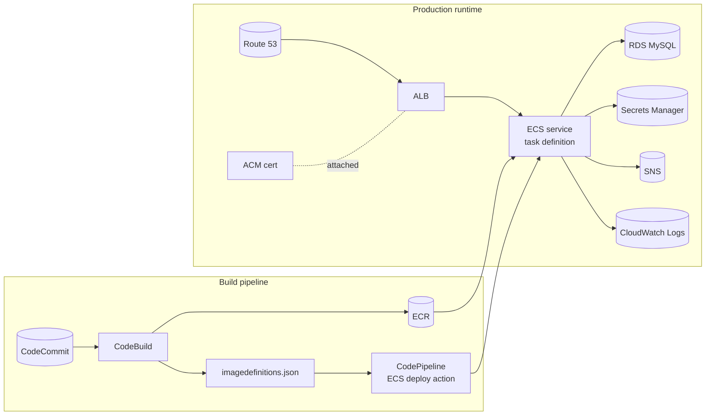

### 2.4 Secrets management

**Storage**: AWS Secrets Manager, one JSON secret per environment, organised under the `/SimplProcess/payment_application/` namespace.

**Staging secret path** (from `staging-front-codebuild-buildspec.yaml`): `/SimplProcess/payment_application/dev`. Known keys:

| Key | Used by |
|---|---|
| `APPLICATION_URL` | Frontend build → `REACT_APP_BACKEND_URL` |
| `APPLICATION_HOST` | Frontend build → `REACT_APP_APPLICATION_HOST` (WebSocket host) |
| `LEGAL_INFO_NMLS` | Frontend build → `REACT_APP_NMLS` |
| `LEGAL_INFO_TERMS` | Frontend build → `REACT_APP_TERMS_URL` |
| `LEGAL_INFO_LICENSING` | Frontend build → `REACT_APP_LICENCING_URL` |
| `UNKNOWN_LOAN_TYPE_PHONE` | Frontend build → `REACT_APP_WORKING_PHONE` |
| `UNKNOWN_LOAN_TYPE_EMAIL` | Frontend build → `REACT_APP_WORKING_EMAIL` |

By symmetry the **production secret path** is presumably `/SimplProcess/payment_application/prod`, though the production frontend buildspec does not enumerate the keys — they're injected into the CodeBuild project as plain env vars (or pulled from a different mechanism owned outside this repo).

**Backend runtime secrets** (resolved at JVM startup via AWS SDK v2): database creds (`DB_CONNECTION_URL`, `DB_USERNAME`, `DB_PASSWORD`), Stripe webhook secrets per channel (`STRIPE_WEBHOOK_SECRET_CREDIT_CARD`, `STRIPE_WEBHOOK_SECRET_ACH`), Stripe API keys per channel (`STRIPE_SECRET_*`, `STRIPE_PUBLIC_*`), Plaid (`PLAID_API_SECRET`), SNS access keys (`ADMIN_SNS_ACCESS_KEY_ID`, `ADMIN_SNS_SECRET_ACCESS_KEY`), `ADMIN_SECRET` (the `AdminKey` header value).

**Frontend secrets are build-time, not runtime**: every `REACT_APP_*` is baked into the static JS bundle at `npm run build`. Rotating any of them — even just a phone number — requires a full image rebuild and ECS deploy.

**KMS**: default AWS-managed keys (no customer-managed CMK referenced in the codebase). If FIPS / customer-managed-key compliance is a future requirement, this is a small change in Secrets Manager + ECR config and does not touch the app code.

**Rotation**: no automated rotation is configured. Stripe / Plaid / DB credentials are rotated manually by updating the Secrets Manager value and restarting ECS tasks.

### 2.5 Deploy & rollback

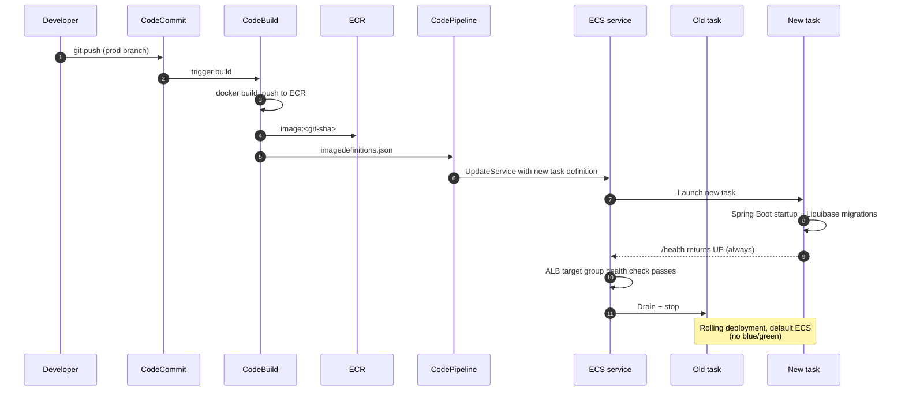

**Forward deploy**:
1. Commit → CodeCommit (production branch)
2. CodeCommit trigger → CodeBuild → Docker build → push `image:<git-sha>` to ECR
3. CodeBuild emits `imagedefinitions.json` artifact
4. CodePipeline ECS deploy action picks it up → calls `UpdateService` with a new task-definition revision pointing at `<git-sha>`
5. ECS launches new task(s), waits for ALB target-group health checks, drains old task(s)

**Rollback**:
- **Production**: ECS service update pointing at any prior `<git-sha>` ECR tag — no rebuild needed because tags are content-addressable
- **Staging**: tags are mutable (`latest`), so rolling back means re-running an older CodeBuild against the older commit. There is no "previous staging image" sitting in ECR — once you push, the old one is replaced.

**Database migrations**: Liquibase runs at JVM startup. Every ECS task that comes up runs through any pending changesets before serving traffic. Implications:
- The deploy itself migrates the schema — there is no separate migration step
- Backward-incompatible schema changes will break old tasks during the rollout window
- Multi-replica race on the same migration is handled by Liquibase's own lock table (`databasechangeloglock`)
- A rollback that requires reverting a schema change must be done manually against MySQL — Liquibase does not auto-rollback

**Deployment cadence / approvals**: not codified in this repo. Whether CodePipeline requires manual approval before promoting to ECS, and whether there's a staging soak time, is owned outside the codebase.

### 2.6 Observability footprint

The operational posture is intentionally light — most of these gaps are also flagged in §6:

| Channel | Status | Notes |
|---|---|---|
| **Container logs** | CloudWatch Logs | Default ECS `awslogs` driver assumed. Log group naming, retention, and structured-log parsing rules are not in the codebase. |
| **Application metrics** | None | `spring-boot-starter-actuator` is on the classpath but no endpoints are exposed — `/actuator/metrics` is unreachable. No Micrometer, Prometheus, CloudWatch metrics, or custom counters. |
| **APM / tracing** | None | No Datadog, New Relic, Sentry, OpenTelemetry, or X-Ray. |
| **Error alerting** | SMTP only | `MailMaintainersService` emails `mail.exception.to` (`nick.skorokhod@botscrew.com, simpl@nflp.com`) on every unhandled exception. That is the only outbound alert in the system. |
| **ALB health check** | `GET /health` | Returns a hardcoded `'status': 'UP'` — does **not** verify DB / Stripe / LendingQB connectivity. The ALB will keep traffic on a backend whose database has gone away. |
| **Pipeline alerting** | Not in repo | CodeBuild / CodePipeline failure notifications are typically wired via CloudWatch Events + SNS topic — neither is configured in this codebase. |
| **Audit log** | None | No DB audit table; no CloudTrail-derived report. ECS task IAM role activity is captured by CloudTrail by default at the AWS account level. |
| **Backup / DR** | RDS default | RDS automated snapshots / PITR config is on the instance, not in this repo. No application-layer export/restore tooling. |

If the team wants meaningful production visibility, the smallest practical step is to expose Actuator's `/actuator/health` (which the dependency already supports) and re-point the ALB target group at it — this would at least make ALB drain a task whose database is unreachable.

---

## 3. Architecture

### 3.1 Backend — `payment-application`

#### 3.1.1 Stack and layout

From [`pom.xml`](../processing-app/payment-application/pom.xml):

- Java 8, Spring Boot 2.4, Maven, Lombok, MapStruct, Hibernate/JPA, Liquibase
- Stripe Java SDK 24.21.0, Plaid Java SDK 8.1.0
- AWS SDK v2 (SNS, Secrets Manager)
- Spring Mail (SMTP), Thymeleaf (receipt HTML), Flying Saucer 9.1.20 (HTML → PDF), Apache HttpClient 4.5
- Spring WebSocket + Messaging (STOMP), Spring AOP

**Maven profiles** ([`pom.xml`](../processing-app/payment-application/pom.xml):346–368): `local` (active by default), `staging`, `production`. Each sets `spring.profiles.active` to its own name via resource filtering; the Docker build picks one via `mvn -P $ENVIRONMENT`.

**Package layout** under `src/main/java/com/botscrew/payment/`:

| Package | Responsibility |
|---|---|
| `stripe/` | Stripe controllers, services, webhook handler, event idempotency, event handlers, mappers |
| `payment/` | Core payment orchestration (Spring AOP aspects) |
| `plaid/` | Plaid SDK integration (see note in §4 — frontend has no Plaid usage; current production role unclear) |
| `lqb/` | LendingQB / MeridianLink integration: loan lookup, document upload |
| `refund/` | Refund processing (admin-initiated) |
| `reciept/` | Receipt rendering (Thymeleaf → Flying Saucer PDF) |
| `mail/` | Mail config + maintainer-alert service |
| `admin/` | Admin login, SMS 2FA, admin dashboard |
| `document_scheduler/` | `@Scheduled` async retry of LendingQB document uploads |
| `principle/` | Main public page controller, `LoanPrincipal`, `PaymentSessionInfo` |
| `redirect/`, `synchronization/`, `toggle/`, `merging/`, `formatter/`, `util/` | Supporting utilities |
| `health_check/` | `/health` endpoint |

Entry point: `PaymentApplication.java` (`@SpringBootApplication`).

Layering: REST controllers → services → JPA repositories → MySQL. Spring AOP aspects implement cross-cutting payment + synchronization logic. Schema is owned by Liquibase (`db/changelog/liquibase-changelog.xml`); JPA `ddl-auto=none`.

#### 3.1.2 Security & auth

`HttpSecurityConfig` (extends `WebSecurityConfigurerAdapter`) installs a custom filter chain.

| # | Filter | Triggers on | What it does |
|---|---|---|---|
| 1 | `AdminLoginFilter` | `POST /admin/login` | JSON `{email, password}` → verifies against `admin_user.password_hash` (BCrypt via Spring `PasswordEncoder`). On success kicks off 2FA and returns `{success: true, requires2fa: true}` without creating an authenticated session. |
| 2 | `Admin2FAFilter` | `POST /admin/login/2fa` | JSON `{code}` → compares against `Pending2FA` stored in `HttpSession` (6-digit string from `SecureRandom`, 5-min TTL, 60-second resend cooldown). On success sets `AdminAuthenticationToken` (`ROLE_ADMIN`) in the session. |
| 3 | `CustomFilter` | `/loan-number/{loanNumber}` | Pulls the loan number out of the URL, wraps it as `LoanNumberAuthenticationToken`, delegates to `CustomProvider` which verifies the loan exists. The "principal" of the public payment flow is the loan number itself — there is no end-user account. Redirects an authenticated admin to the admin panel if they hit a public path. |
| 4 | `AdminFeaturesFilter` | `/internal/**` | Either an admin session (set by filter 2) OR a request-header secret: header name `AdminKey` (`application.internal.auth.header`), value from env var `ADMIN_SECRET` (`application.internal.auth.secret`). Case-sensitive string equality. |

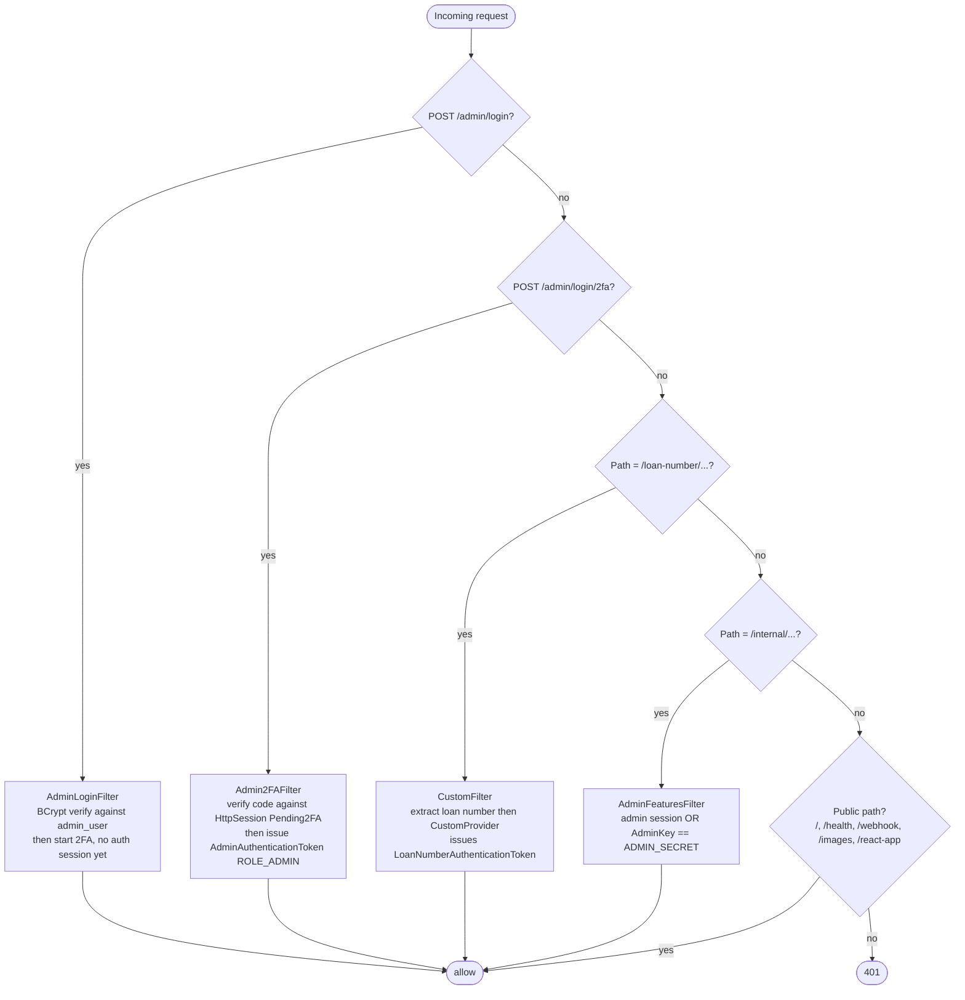

Session config: `maximumSessions(-1)` (unlimited concurrent sessions per principal), backed by `SessionRegistryImpl`. 15-minute idle timeout. COOKIE tracking. Configurable CORS allowed origins.

Public paths: `/`, `/loan-number/*`, `/admin/login/**`, `/health`, `/images/**`, `/react-app/**`, `/webhook/**`. Everything else requires authentication; `/internal/**` additionally requires `ROLE_ADMIN`. **No external IdP** (no Cognito, Auth0, SSO). **No CSRF token** — auth relies on session cookies (`credentials: include` on the SPA side).

#### 3.1.3 REST API surface

Auth-related endpoints handled at the filter level (`POST /admin/login`, `POST /admin/login/2fa`, `GET /loan-number/{loanNumber}`) are listed in §3.1.2.

| Controller | Method | Path | Request | Response | Notes |
|---|---|---|---|---|---|
| `HealthCheckController` | GET | `/health` | — | `String` literal `'status': 'UP'`, 200 OK | **Not** Spring Actuator. Pure liveness — no DB / Stripe / LQB checks. |
| `MainController` | GET | `/` | — | `ModelAndView` (index.html + config map) | Serves the SPA shell with backend URL, NMLS, terms, licensing, support contact baked in. |
| `MainController` | GET | `/error` | — | Same as `/` | Routes error redirects back through the SPA shell. |
| `LqbController` | GET | `/loan-details/` | — (loan number from authenticated `LoanPrincipal`) | `LoanDTO` | Fetches loan record from LendingQB via `LqbLoanApiService`. |
| `LqbController` | GET | `/loan-number/{loanNumber}` | path param | void | Stub — auth filter does the actual work; controller body is empty. |
| `StripeController` | POST | `/stripe/process_payment/credit_card` | `CreditCardPaymentRequest` | `String` (Stripe client_secret) | Creates a card-channel Stripe PaymentIntent. |
| `StripeController` | POST | `/stripe/process_payment/ach_payment_intent` | `AchPaymentRequest` | `String` (Stripe client_secret) | Creates an ACH PaymentIntent; reuses any active `ach_payment_intent_draft` for the loan. |
| `StripeController` | GET | `/stripe/payment_info` | — | `PaymentInfoDTO` | Returns current `PaymentSessionInfo` (state + last result). |
| `StripeController` | GET | `/stripe/payment_method` | — | `PaymentMethod` | Last-used or default method for this session. |
| `StripeController` | GET | `/stripe/ping` | — | `PaymentStatus` | Cheap status echo for liveness. |
| `StripeController` | GET | `/stripe/initiate_delayed_ping` | — | async `PaymentStatus` | Async ping with timeout — used by `StripePingService` for long-poll fallback when WebSocket is unavailable. |
| `StripeWebhookController` | POST | `/webhook/stripe/charge/credit_card` | raw JSON + `Stripe-Signature` header | 200 OK | Verifies signature with `stripe.webhook.secret.credit_card`, idempotency-checks via `stripe_webhook_event`, dispatches to handler (§3.1.4). |
| `StripeWebhookController` | POST | `/webhook/stripe/charge/ach` | raw JSON + `Stripe-Signature` header | 200 OK | Same as above but `stripe.webhook.secret.ach`. |
| `RefundController` | POST | `/internal/refund` | `RefundRequest` | 200 OK | Admin-only. Issues Stripe refund + updates the related `receipt_log` row. |
| `AdminLoginController` | GET | `/admin/login/me` | (session) | `AdminMeResponse` | "Am I logged in / do I owe a 2FA code?" check used by the SPA's login page. |
| `AdminLoginController` | POST | `/admin/login/2fa/resend` | (session) | 204 No Content | Resends the SMS code (subject to 60-second cooldown). |
| `InternalController` | GET | `/internal/` | — | `{authenticated: true}` | Auth-probe used by SPA after admin login. |
| `ReceiptLogController` | GET | `/internal/api/receipt-logs` | query: `page`, `size`, `sort`, `sortField`, `loanNumber`, `transactionStatus`, `paymentIntentId`, `chargeId`, `since`, `until` | `PagedResponseDTO<ReceiptLogListItemDTO>` | **Currently returns mock data** — admin dashboard not yet wired to the real `receipt_log` table. |
| `ReceiptLogController` | GET | `/internal/api/receipt-logs/{id}` | path param | `ReceiptLogDetailDTO` | Same caveat — mock data. |

#### 3.1.4 Stripe event handlers

`StripeWebhookEventHandlerService` builds a `Map<PaymentEventStatus, StripeEventHandler<?>>` at startup by collecting every `StripeEventHandler` bean and keying it by `status()`. Each handler can further filter by channel (`supports(LoanType)`).

| Handler | Event(s) handled | Channel | Side effects |
|---|---|---|---|
| `StripeChargeSuccessEventHandlerService` | `charge.succeeded` | both | Update `PaymentSessionInfo` → `POST_PAYMENT`, update `receipt_log.transaction_status` → `PAID`, call `LoanService.uploadPdf()` → renders receipt + uploads to LendingQB (CC only — see §3.1.5) |
| `StripeFailEventHandlerService` | `charge.failed` | both | Delegates to `FailedPaymentStripeEventHandler` |
| `StripePendingEventHandlerService` | `charge.pending` | ACH only | `PaymentSessionInfo` → `IN_PAYMENT` |
| `StripePaymentIntentSucceededEventHandler` | `payment_intent.succeeded` | ACH only | Mark `ach_payment_intent_draft.status` = `SUCCEEDED`, `PaymentSessionInfo` → `POST_PAYMENT`, `receipt_log` → `PAID`. Retrieves the charge via Stripe API if absent from the webhook payload. |
| `StripePaymentIntentProcessingEventHandler` | `payment_intent.processing` | ACH only | Mark draft `CONFIRMED`, `PaymentSessionInfo` → `IN_PAYMENT`, `receipt_log` → `PROCESSING` |
| `StripePaymentIntentRequiresActionEventHandler` | `payment_intent.requires_action` | ACH only | `PaymentSessionInfo` → `IN_PAYMENT` (no DB update) |
| `StripePaymentIntentFailedEventHandler` | `payment_intent.payment_failed` | ACH only | Mark draft `CANCELED`, delegate to `FailedPaymentStripeEventHandler` |
| `StripePaymentIntentCanceledEventHandler` | `payment_intent.canceled` | ACH only | Mark draft `CANCELED`, reset `PaymentSessionInfo` to `PRE_PAYMENT` |
| `FailedPaymentStripeEventHandler` (shared, not in map) | — | — | `receipt_log` → `FAILED`, update session result with code/message. For ACH: state → `POST_PAYMENT`. For CC: state → `PRE_PAYMENT`. |

Any event type that doesn't have a registered handler maps to `PaymentEventStatus.UNKNOWN` and is acknowledged-and-ignored.

After every successful credit-card webhook, `resetPaymentSessionForCreditCard()` replaces the entire `PaymentSessionInfo` with a fresh instance so a new card payment can start cleanly.

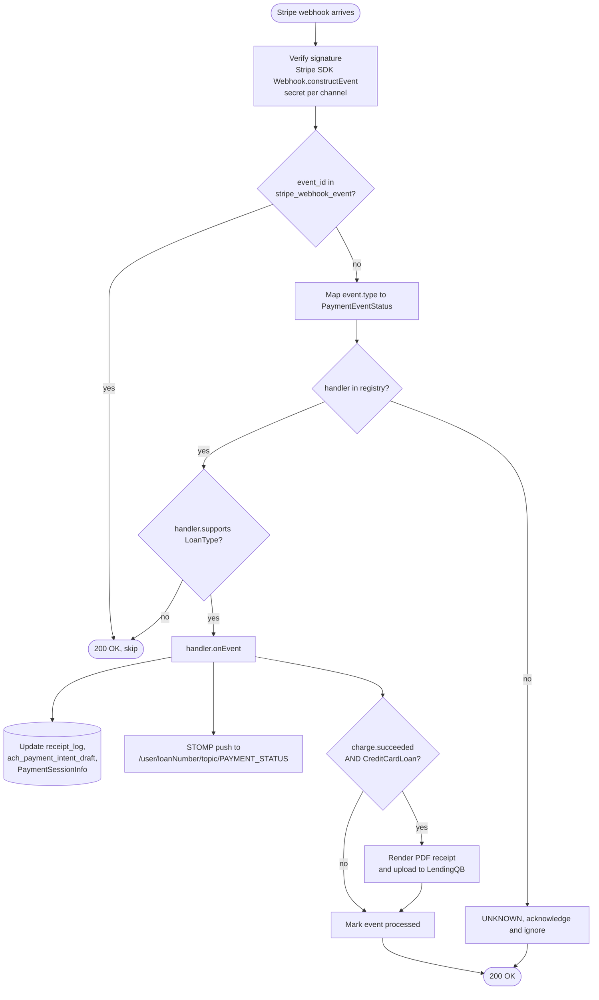

#### 3.1.5 Receipt generation pipeline

End-to-end, only invoked on `charge.succeeded`:

1. `StripeChargeSuccessEventHandlerService` calls `LoanService.uploadPdf(loan, request, charge)`.
2. `ReceiptService.generateEncodedReceipt()` picks a `ReceiptContextService` from the auto-wired list whose `supports(loan, request)` returns true. **Two implementations exist**:
   - `CreditCardReceiptContextService` — enabled
   - `AchReceiptContextService` — **disabled via `@ConditionalOnExpression("false")`**
3. The picked context builds a Thymeleaf model (loan, borrower, items, totals, charge, last-4, payment date).
4. `templateEngine.process("thymeleaf/receipt", ctx)` renders [`templates/thymeleaf/receipt.html`](../processing-app/payment-application/src/main/resources/templates/thymeleaf/receipt.html) (template path from `custom-receipt.properties`).
5. Flying Saucer's `ITextRenderer` converts the rendered HTML to a PDF byte array.
6. Upload: `lqbClient.uploadPdf(loanNumber, encodedReceipt)` → LendingQB `EDocsService.UploadPDFDocumentResponse`. On failure the row is persisted to `document_info` for the scheduler (§3.1.6) to retry.

**Two consequential omissions** in this pipeline:

- The PDF is **uploaded to LendingQB**, not emailed to the customer. There is no customer-facing email template in the repo.
- ACH payments **do not generate a receipt at all** because `AchReceiptContextService` is conditionally disabled. Only the credit-card flow produces a PDF.

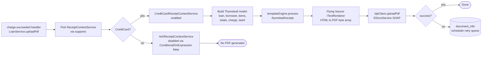

#### 3.1.6 Document resend scheduler

| | |
|---|---|
| Class | `DocumentResendScheduler` → `DocumentResendExecutor` → `DocumentResendAsyncExecutor` (`@Async`) |
| Trigger | `@Scheduled(fixedDelay = 300000)` — every 5 minutes |
| Behavior | `findAll()` pending rows in `document_info`, partition into batches of 3, async retry `lqbClient.uploadPdf()` per row |
| Success | Row deleted from `document_info` |
| Failure | Row left in place; logged; no max-retry cap |
| Concurrency safety | **None** — no cluster lock. If `payment-application` runs more than one ECS task, both will race the same rows and produce duplicate LendingQB uploads. Whether LendingQB de-dupes on its side is not handled in this codebase. |
| Async pool size | `ASYNC_SCHEDULER_POOL` env var, default 8 |

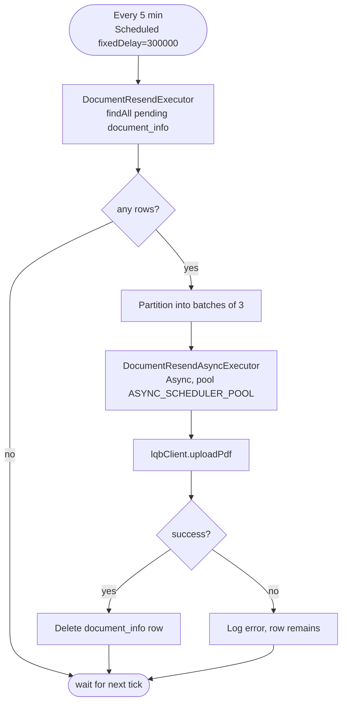

#### 3.1.7 Feature toggles

`custom-toggles.properties` defines two Spring `@Conditional`-based toggles:

| Toggle | Env var | Default | `true` behavior | `false` behavior |
|---|---|---|---|---|
| `toggle.lqb.clients` | `LQB_CLIENTS` | `true` | `LqbClientImpl` — real SOAP calls to LendingQB | `LqbClientMock` — returns hardcoded XML from classpath. Production must keep this `true`. |
| `toggle.payment.ping` | `PAYMENT_PING` | `true` | `ProductionStripeDurationService` — enforces ping rate limit; throws `RateLimitException` if interval too short | `DebugStripeDurationService` — always throws with last-ping timestamp (debug-only) |

#### 3.1.8 Tests

10 test classes under `src/test/java/com/botscrew/payment/` covering `lqb`, `reciept`, `stripe`, `mail`, `formatter` packages. **All use `@SpringBootTest(classes = PaymentApplication.class)` + `@RunWith(SpringRunner.class)` — full Spring context per test, no mocking framework, no Testcontainers, no in-memory H2.** Tests therefore exercise the real configured MySQL and (where applicable) the real LendingQB API — these are integration tests in practice, not unit tests. Spring Security test is on the classpath but unused.

### 3.2 Frontend — `payment-application-front`

#### 3.2.1 Stack

From [`package.json`](../processing-app/payment-application-front/package.json):

- React 16.13 + TypeScript 3.7, Create React App 4
- React Router DOM 5, Material-UI v4, SASS
- `@stripe/stripe-js` 2.4 + `@stripe/react-stripe-js` 2.9 — hosted card fields + ACH bank details collection
- `@stomp/stompjs` 6 + `sockjs-client` 1.5 — WebSocket
- State: localStorage via `SessionService` (no Redux/Zustand); service-locator singletons in `Context.ts`
- Build flag: `NODE_OPTIONS=--openssl-legacy-provider` (legacy Node SSL)
- **Not present**: no analytics, no error-tracking SDK (no Sentry/Datadog), no feature-flag library, **no Plaid SDK** (`react-plaid-link` is absent and no `src/` reference to plaid exists)

Scripts: `dev` (`react-scripts start`), `build` (`react-scripts build`), `eject`.

#### 3.2.2 Page-to-endpoint mapping

| Route | Component (entry) | Backend calls (REST) | WebSocket |
|---|---|---|---|
| `/` (loan number prompt) | `src/modules/flow/loan_number_prompt/component/LoanNumberPrompt.tsx` | `GET /loan-number/{loanNumber}` (validate + establish session) | — |
| `/loan/:loanNumber` (loan details + fee selection) | `src/modules/flow/loan-details/component/LoanDetails.tsx` | `GET /loan-details/`; `GET /stripe/payment_info` | — |
| `/payment` (method selection + submission) | `src/modules/flow/Payment.tsx` → `PaymentStateSwitch.tsx` | `POST /stripe/process_payment/credit_card`; `POST /stripe/process_payment/ach_payment_intent`; `GET /stripe/payment_info`; long-poll fallback `GET /stripe/initiate_delayed_ping` via `StripePingService` | Subscribes to `/user/topic/PAYMENT_STATUS` |
| `/error` | `src/modules/flow/error/component/ErrorPage.tsx` | — (renders support phone/email from build env) | — |
| `/admin-login` | `src/modules/admin/login/AdminLoginPage.tsx` | `GET /admin/login/me`; `POST /admin/login`; `POST /admin/login/2fa`; `POST /admin/login/2fa/resend` | — |
| `/internal` (admin dashboard) | `src/modules/admin/internal/InternalPage.tsx` | `GET /internal/api/receipt-logs?...`; `GET /internal/api/receipt-logs/{id}` | — |

Build-time env vars baked into the bundle via Dockerfile `ARG`s:

| Var | Used for |
|---|---|
| `REACT_APP_BACKEND_URL` | REST API base (prod `https://pay.nflp.com`) |
| `REACT_APP_APPLICATION_HOST` | WebSocket host (`wss://${host}/socket/websocket`) |
| `REACT_APP_NMLS` | NMLS license number in footer (2297) |
| `REACT_APP_TERMS_URL` | Terms of use link |
| `REACT_APP_LICENCING_URL` | Licensing/compliance link |
| `REACT_APP_WORKING_PHONE` | Support phone (error page + footer) |
| `REACT_APP_WORKING_EMAIL` | Support email (error page + footer) |
| `REACT_APP_PLAID_ENVIRONMENT` | Defined in `.env*` but currently **no source reference** in the SPA |

#### 3.2.3 `HttpService`

`src/modules/common/http/service/HttpService.ts` wraps native `fetch`. Methods: `fetch`, `fetchString`, `fetchAs<T>`. URL = `REACT_APP_BACKEND_URL + relativeUrl`. `credentials: "include"` is set on every request. **No `Authorization` header, no CSRF token** — auth piggybacks on the session cookie set by the backend.

Response parsing uses a chain-of-responsibility: `JsonResponseReader` → `TextResponseReader` → `NullResponseReader`. Each inspects `Content-Type`; the first match wins.

Error handling: on 3xx with `response.redirected`, extracts query params and calls `BrowserService.redirectOnParams()`. On non-2xx, reads `response.data.message`/`.error` and throws an `HttpError` with the status code. Network failures aren't caught — they propagate to the caller.

#### 3.2.4 WebSocket

`src/modules/websocket/service/WebSocketService.ts` uses `@stomp/stompjs` 6.

| | |
|---|---|
| URL | `wss://${REACT_APP_APPLICATION_HOST}/socket/websocket` |
| Subscription destination | `/user/topic/PAYMENT_STATUS` — Spring's `convertAndSendToUser` resolves this against the session's `LoanPrincipal.getName()` (i.e. loan number), so each session only receives its own loan's events |
| Payload | `PaymentStatus { state: PaymentState, result: PaymentResult { paid: boolean, ... } }` (serialized JSON) |
| Lifecycle | `activate()` in `PaymentStateSwitch.componentDidMount()`, `deactivate()` in `componentWillUnmount()` |
| Reconnect | Library defaults (~10-sec heartbeat, auto-reconnect on disconnect). No custom reconnect/heartbeat policy. |

### 3.3 Database

| | |
|---|---|
| Engine | MySQL 8.0.21 |
| Schema | `payment` |
| Connection | env vars `DB_CONNECTION_URL`, `DB_USERNAME`, `DB_PASSWORD` (Secrets Manager in prod) |
| Migrations | Liquibase — `src/main/resources/db/changelog/liquibase-changelog.xml` includes versioned files `1.0`, `2.0`, `2.1`, `2.2`, `2.3` plus a `run_always_changelog.xml` |
| JPA | `ddl-auto=none` — Liquibase is authoritative |

#### Tables

**`loan`** — abstract base, single-table inheritance, discriminator `loan_type` ∈ {`APPRAISAL_FEE_LOAN`, `INTEREST_LOAN`}

| Column | Type | Null | Notes |
|---|---|---|---|
| `id` | BIGINT | no | PK, IDENTITY |
| `loan_number` | VARCHAR | no | LQB-assigned loan number |
| `loan_status` | VARCHAR (enum) | no | `LoanStatus` — UNKNOWN, APPROVED, etc. |
| `borrower_full_name`, `borrower_first_name`, `borrower_last_name`, `borrower_email`, `borrower_working_phone` | VARCHAR | no | Embedded `BorrowerInfo` |
| `loan_officer_full_name`, `loan_officer_email`, `loan_officer_working_phone` | VARCHAR | no | Embedded `LoanOfficerInfo` |
| `property_street`, `property_city`, `property_state`, `property_zip_code` | VARCHAR / enum / INT | no | Embedded `PropertyInfo` |
| `application_signed_date`, `itp_date` | DATE | no | Past-or-present |
| `loan_type` | VARCHAR | no | Discriminator — `insertable=false, updatable=false` |
| **`CreditCardLoan` adds** — `fee`, `credit_report_fee`, `loan_amount` | DECIMAL | no | Positive |
| **`AchLoan` adds** — `payment_amount`, `payment_due`, `payment_due_investor` | DECIMAL / DATE | no/no/yes | Payment due date and optional investor due date |

**`receipt_log`** — one row per loan (1:1, cascade delete)

| Column | Type | Notes |
|---|---|---|
| `id` | BIGINT | PK |
| `loan_id` | BIGINT | FK → `loan.id`, `@OneToOne` cascade ALL |
| `transaction_charge_id`, `transaction_payment_intent_id` | VARCHAR | Stripe IDs |
| `transaction_status` | VARCHAR (enum) | `TransactionStatus` — PAID/FAILED/PROCESSING. Default `'PAID'` set by `run_always_changelog.xml`. |
| `payment_time` | DATETIME | UTC |
| `receipt_url` | VARCHAR | URL if hosted externally |
| `agreed_to_terms` | BOOLEAN | |
| `credit_card_last_4`, `credit_card_type`, `credit_card_name_on_card` | INT / VARCHAR | Embedded `CreditCardInfo` |
| `charge_type` | JSON | Array of charge types (Hibernate `@Type` JSON) |

**`document_info`** — scheduler retry queue for LendingQB uploads

| Column | Type | Notes |
|---|---|---|
| `id` | BIGINT | PK |
| `loan_number` | VARCHAR | Not an FK |
| `document` | LONGTEXT | PDF content (base64) or reference |

**`stripe_webhook_event`** — webhook idempotency

| Column | Type | Notes |
|---|---|---|
| `id` | BIGINT | PK |
| `event_id` | VARCHAR(255) | **UNIQUE** — the idempotency key |
| `event_type` | VARCHAR | Stripe event type string |
| `payment_intent_id` | VARCHAR | Indexed |
| `processed_at`, `created_at` | DATETIME | |
| Indexes | `idx_stripe_webhook_event_id`, `idx_stripe_webhook_payment_intent_id` |

**`admin_user`**

| Column | Type | Notes |
|---|---|---|
| `id` | BIGINT | PK |
| `email` | VARCHAR | UNIQUE |
| `password_hash` | VARCHAR | BCrypt |
| `phone_for_2fa` | VARCHAR(32) | Destination for SNS SMS |
| `created_at`, `updated_at` | TIMESTAMP | Auto-managed |

**`ach_payment_intent_draft`** — reusable ACH PaymentIntents

| Column | Type | Notes |
|---|---|---|
| `id` | BIGINT | PK |
| `loan_number` | VARCHAR(64) | One active draft per loan (in practice) |
| `stripe_payment_intent_id` | VARCHAR(255) | UNIQUE |
| `status` | VARCHAR (enum) | `PENDING`, `CONFIRMED`, `SUCCEEDED`, `CANCELED`, `USED`, `EXPIRED` |
| `created_at`, `updated_at`, `expires_at` | TIMESTAMP | TTL from `STRIPE_ACH_DRAFT_TTL_SECONDS` (default 86400 = 24 h) |
| Indexes | `idx_ach_draft_loan_number`, unique on PI ID, composite on `(status, created_at)` |

**Absent**: no refund table (refunds annotate `receipt_log` in-place); no audit-log table; no application-managed users beyond `admin_user` (payer identity is the loan number).

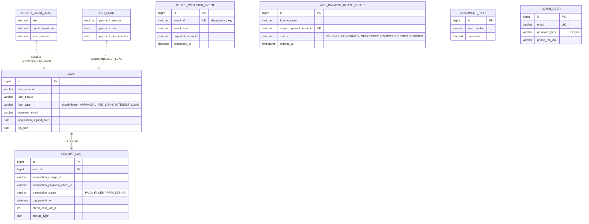

Relationships in the diagram are explicit (`loan` ↔ `receipt_log` 1:1 via FK with cascade ALL). The remaining tables stand alone — `document_info` references a `loan_number` but is not a foreign key; `ach_payment_intent_draft` similarly carries `loan_number` as a business key, not a FK; `stripe_webhook_event` is isolated.

---

## 4. External Dependencies

| Service | Purpose | Integration shape | Direction |
|---|---|---|---|
| **Stripe** | Card + ACH payments, PaymentIntents, refunds | Java SDK 24.21.0 server-side; Stripe.js + `@stripe/react-stripe-js` on SPA. Base URL `https://api.stripe.com`. Webhook signature verified via `Webhook.constructEvent` using separate per-channel secrets: `STRIPE_WEBHOOK_SECRET_CREDIT_CARD`, `STRIPE_WEBHOOK_SECRET_ACH`. Separate API keys per channel: `STRIPE_SECRET_CREDIT_CARD`/`STRIPE_PUBLIC_CREDIT_CARD`, `STRIPE_SECRET_ACH`/`STRIPE_PUBLIC_ACH`. | Outbound REST + inbound webhooks |
| **LendingQB / MeridianLink** | Loan data lookup + post-payment PDF receipt upload | SOAP / XML over RestTemplate. OAuth token at `secure.mortgage.meridianlink.com/oauth/token`; main API at `webservices.lendingqb.com/los/webservice`; document upload at `secure.lendingqb.com/los/webservice/EDocsService.asmx`. Gated by `LQB_CLIENTS` toggle (real client vs mock). | Outbound REST + SOAP |
| **AWS SNS** | Admin login 2FA via SMS | AWS SDK v2 (`SnsSmsService`). Inline message body: `"Your admin login verification code is: {code}"`. Gated by `ADMIN_SNS_SMS_ENABLED`; `NoOp2FASmsSender` is the disabled-mode fallback. Credentials via `ADMIN_SNS_ACCESS_KEY_ID` / `ADMIN_SNS_SECRET_ACCESS_KEY`, region `us-east-1`. | Outbound |
| **AWS Secrets Manager** | Runtime secret resolution at startup | AWS SDK v2 | Outbound |
| **SMTP (Spring Mail)** | Ops alert emails to maintainers when an unhandled exception fires | `MailMaintainersService` (`mail.exception.from`, `mail.exception.to`). Prod defaults route to `nick.skorokhod@botscrew.com, simpl@nflp.com`. Note: customer-facing `MailService` exists but its `JavaMailSender` calls are commented out — receipt emails are not actually sent. | Outbound |
| **MySQL 8.0.21** | Application database | Hibernate/JPA + Liquibase | Outbound |
| **Plaid** | ⚠️ **Status uncertain.** Java SDK 8.1.0 is on the classpath, a `plaid/` module exists, and `PLAID_API_SECRET` is configured per environment — but the **SPA has no Plaid Link integration** (no `react-plaid-link` dep, no source references). Either Plaid is used server-side only (e.g., for backend-side account verification), or the integration is dormant. Worth confirming with whoever owns this code before describing it externally. | TBD |

**In-process libraries**: Thymeleaf (receipt HTML template), Flying Saucer 9.1.20 (HTML → PDF).

**Notable absences:**

- **No external message broker** — no SQS, SNS-as-queue, Kafka, RabbitMQ, or Redis. All async work is in-process `@Scheduled` + `@Async`.
- **No external identity provider** — auth is fully in-app.
- **No APM / error tracking** — no Sentry, Datadog, New Relic, AppDynamics, Prometheus, Micrometer, Sleuth, or Zipkin dependencies. The only operational visibility is the `mail.exception.to` blast on unhandled exceptions.
- **No Spring Boot Actuator endpoints exposed** — the starter is on the classpath but no `management.endpoints.web.exposure.include` configuration, so `/actuator/*` is not reachable. `/health` is a custom plain-string endpoint.
- **No CDN configuration in-repo** — if CloudFront fronts `pay.nflp.com`, it is provisioned outside this codebase.

---

## 5. Workflow / Data Flow

### 5.1 System context

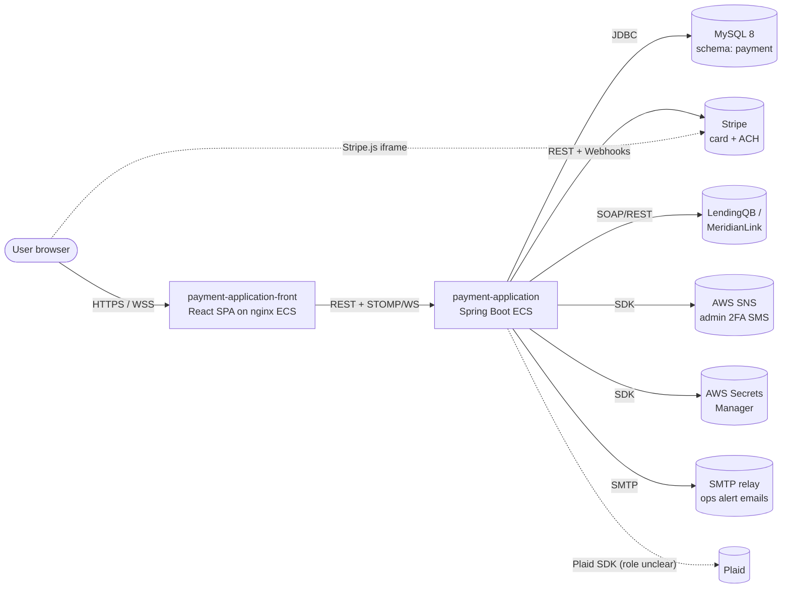

### 5.2 Credit-card payment (CreditCardLoan / APPRAISAL_FEE_LOAN)

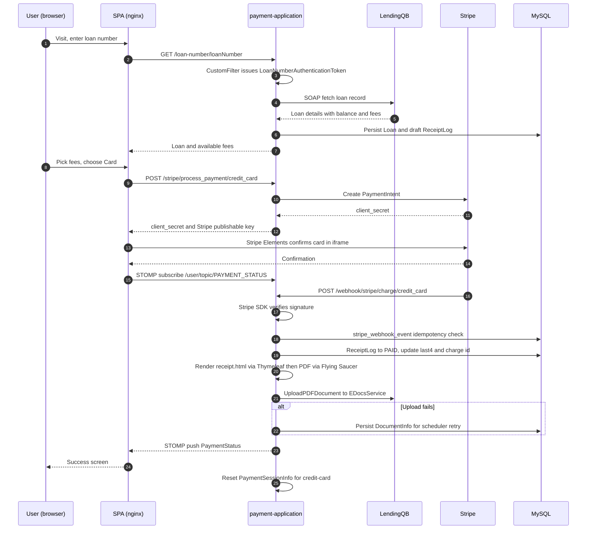

Stripe event types recognised by the webhook handler (`PaymentEventStatus`): `charge.succeeded`, `charge.failed`, `charge.pending`, `payment_intent.succeeded`, `payment_intent.processing`, `payment_intent.payment_failed`, `payment_intent.requires_action`, `payment_intent.canceled`. Anything else → `UNKNOWN` (acknowledged-and-ignored).

### 5.3 ACH payment (AchLoan / INTEREST_LOAN)

Shape mirrors §5.2 with these differences:

1. **No Plaid Link on the customer side.** The SPA collects routing/account directly via the `PrePaymentAch` component and posts to `/stripe/process_payment/ach_payment_intent`. Stripe handles ACH bank validation.
2. **PaymentIntent reuse.** A row is written to `ach_payment_intent_draft` (loan number + PI id + status + 24 h TTL via `STRIPE_ACH_DRAFT_TTL_SECONDS`) so a returning user can resume the same draft.
3. **Async settlement.** ACH settles in days, not seconds. The user typically closes the tab before `charge.succeeded` arrives. The STOMP stream reports `payment_intent.processing` as an intermediate state. Final state transitions happen on the eventual `charge.succeeded` (or failure) webhook, regardless of whether the user is still connected.
4. **No PDF receipt is generated.** `AchReceiptContextService` is disabled (`@ConditionalOnExpression("false")`) — only the credit-card path produces a receipt. ACH payments leave a `receipt_log` row with the Stripe IDs and status, but no PDF and no LendingQB upload.

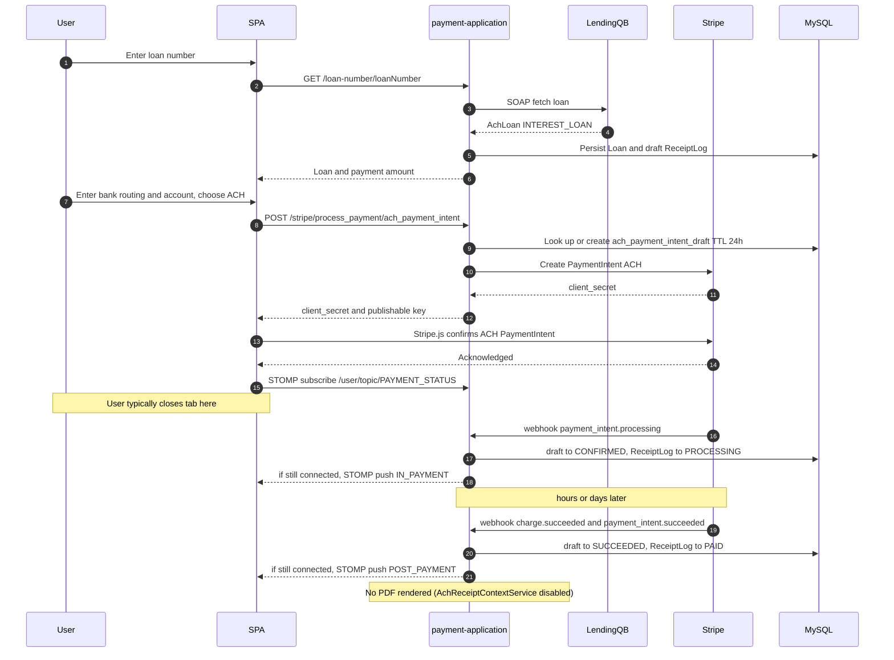

### 5.4 Admin 2FA login

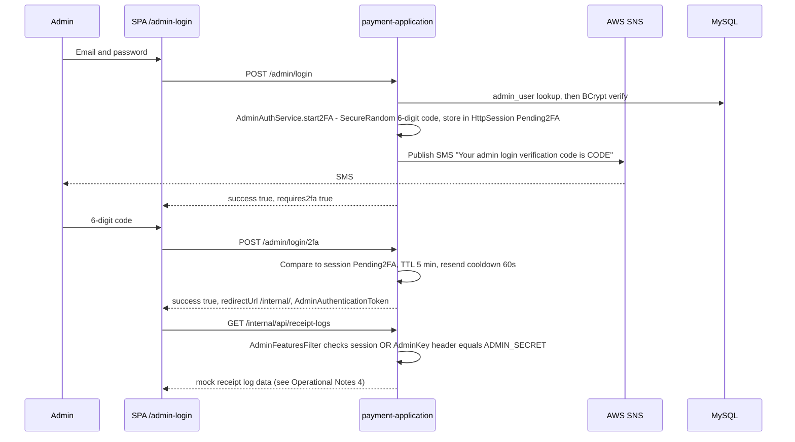

### 5.5 Refund

Admin-initiated only via `POST /internal/refund` (no customer-facing path). The controller calls Stripe's refund API, updates the related `receipt_log` row in place (there is no `refund` table), and an exception-style ops mail goes to maintainers if the call fails. No customer refund email or receipt is sent.

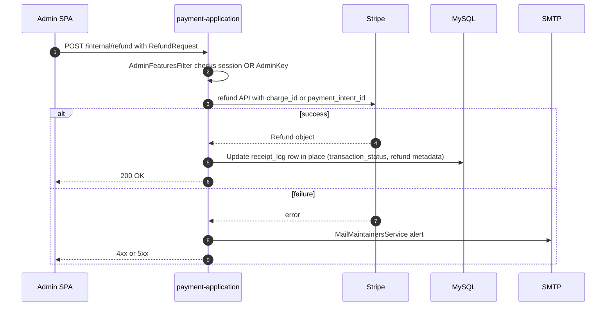

### 5.6 WebSocket payment-status push

- Endpoint `/socket` with SockJS fallback — client connects to `wss://${REACT_APP_APPLICATION_HOST}/socket/websocket`
- Simple broker prefix `/topic`; application prefix `/app`
- Authoritative topic `/topic/PAYMENT_STATUS`, delivered per-user via Spring's `convertAndSendToUser` → effective destination `/user/{loanNumber}/topic/PAYMENT_STATUS` (the STOMP user identity is `LoanPrincipal.getName()`, i.e. the loan number). Frontend subscribes to `/user/topic/PAYMENT_STATUS` and Spring resolves the user prefix automatically.
- Payload `PaymentStatus { state: PaymentState, result: PaymentResult { paid: boolean, ... } }`
- All concurrent browser sessions for the same loan number receive the same message

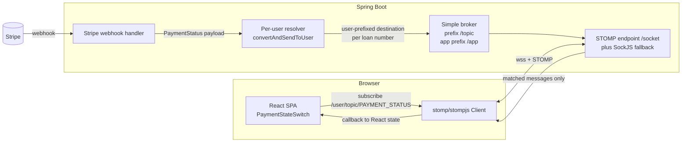

### 5.7 PaymentSessionInfo state machine

| State | Set by |
|---|---|
| `PRE_PAYMENT` (initial) | New `LoanPrincipal` on first auth |
| `IN_PAYMENT` | `payment_intent.processing` / `payment_intent.requires_action` / `charge.pending` |
| `POST_PAYMENT` | `payment_intent.succeeded` / `charge.succeeded` |
| `PRE_PAYMENT` (reset) | `payment_intent.canceled` (ACH); failed credit-card charge; `resetPaymentSessionForCreditCard()` after any CC success |

State lives in the `LoanPrincipal` attached to the HTTP session via `SessionRegistryImpl`. There is no DB-backed projection of this state — it is purely in-memory per session. Multiple concurrent sessions per loan number each get their own `PaymentSessionInfo`.

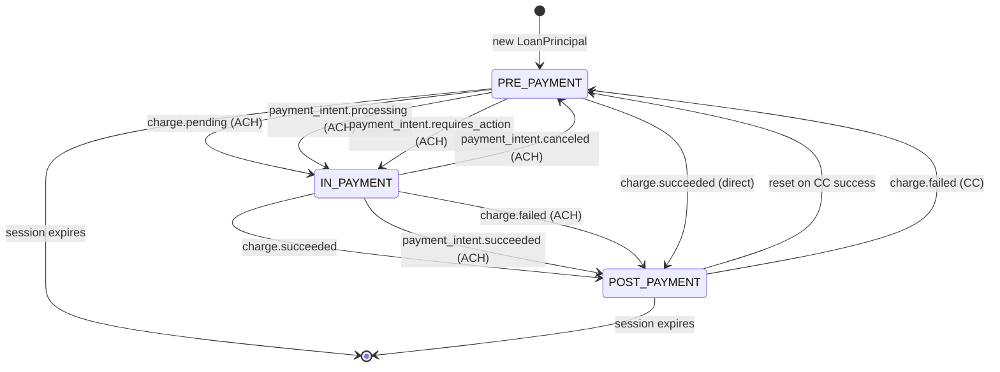

### 5.8 Document resend scheduler

Runs every 5 minutes. Pulls all rows from `document_info`, partitions into batches of 3, async-uploads each to LendingQB. Successful rows are deleted. Failures stay queued indefinitely (no max retries). **Not cluster-safe** — see Operational Notes #5.

---

## 6. Operational notes & caveats

Items worth surfacing to anyone reading this cold:

1. **No APM, no error tracking, no metrics.** The only signal that something has gone wrong in production is an SMTP email to `mail.exception.to` (currently `nick.skorokhod@botscrew.com, simpl@nflp.com`). No Sentry, no Datadog, no Prometheus, no CloudWatch app metrics. `spring-boot-starter-actuator` is on the classpath but no endpoints are exposed.
2. **Customer-facing emails appear not to be sent.** `MailService.java` has its `JavaMailSender` calls commented out — only logging remains. Only `MailMaintainersService` actually emits real SMTP. So customers do not receive receipts by email, despite the receipt-PDF generation pipeline. Worth confirming whether this is intentional (LendingQB upload is the system of record).
3. **ACH payments produce no PDF receipt.** `AchReceiptContextService` is `@ConditionalOnExpression("false")`. Only credit-card payments render and upload a receipt. ACH customers get a Stripe-side confirmation only.
4. **The admin receipt-log dashboard is mock data.** `ReceiptLogController` returns canned `PagedResponseDTO` content; it is not wired to the `receipt_log` table.
5. **Document resend scheduler is not cluster-safe.** No lock or leader election. If `payment-application` runs more than one ECS task, both will race the same `document_info` rows and produce duplicate LendingQB uploads. Currently this is mitigated only by running a single replica.
6. **`ADMIN_SECRET` has a hardcoded default in source** (`custom-application.properties`). The production ECS task definition must override the env var.
7. **Helm chart in `ops/chart` is not the production deploy path.** Its default image points at GitLab. Production goes through CodeBuild → ECR → ECS.
8. **Tests are full-context integration tests against real systems.** All 10 test classes use `@SpringBootTest`, no mocks. They hit the configured MySQL and the real LendingQB API. There is no isolated CI test path — running them requires LQB credentials.
9. **`stripe_webhook_event` has no documented pruning policy.** Indexed on `event_id` and `payment_intent_id`, so growth is fine for lookup speed, but the table grows forever.
10. **Plaid integration status is unclear.** Java SDK + config + `plaid/` module exist on the backend; the SPA has zero Plaid usage. Either Plaid is server-side-only or dormant. Confirm before describing externally.

---

## Quick reference — key files

- **Backend** — [`pom.xml`](../processing-app/payment-application/pom.xml), [`Dockerfile`](../processing-app/payment-application/Dockerfile), [`Makefile`](../processing-app/payment-application/Makefile), [`production-codebuild-buildspec.yaml`](../processing-app/payment-application/production-codebuild-buildspec.yaml), `src/main/resources/application.properties` + `custom-*.properties`, `src/main/resources/db/changelog/liquibase-changelog.xml`, `src/main/resources/templates/thymeleaf/receipt.html`, [`ops/chart`](../processing-app/payment-application/ops/chart)
- **Frontend** — [`package.json`](../processing-app/payment-application-front/package.json), [`Dockerfile`](../processing-app/payment-application-front/Dockerfile), [`nginx.conf`](../processing-app/payment-application-front/nginx.conf), [`production-front-codebuild-buildspec.yaml`](../processing-app/payment-application-front/production-front-codebuild-buildspec.yaml), `.env.production`, `src/App.tsx`, `src/modules/common/http/service/HttpService.ts`, `src/modules/stripe/service/StripeService.ts`, `src/modules/websocket/service/WebSocketService.ts`
